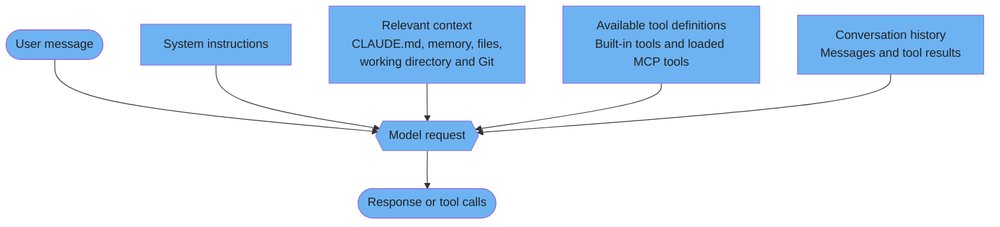
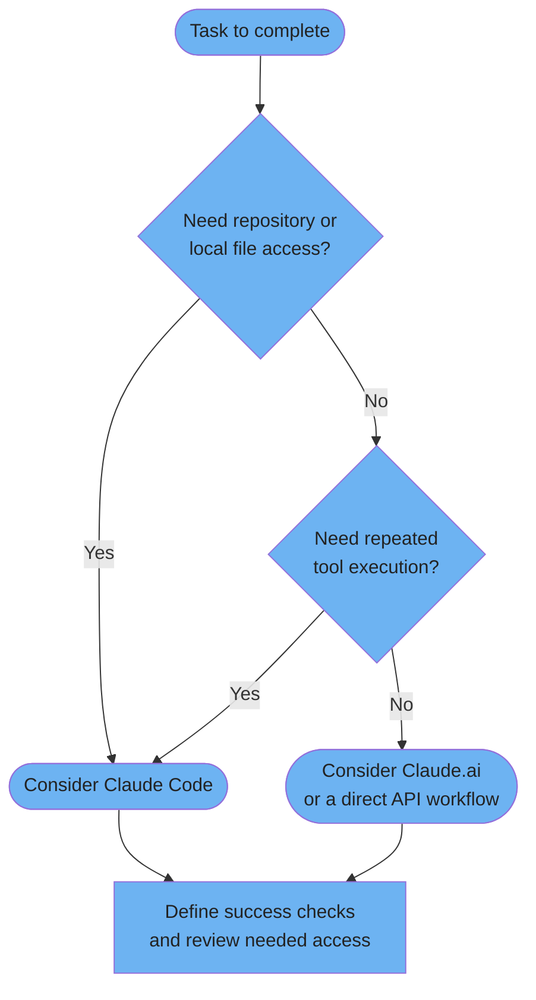

# Foundations

Conceptual models and documented permission behavior for Claude Code.

---

### "Chatbot to Context System": 4-layer model

This four-part teaching model groups the inputs Claude Code uses. The branches are context categories, not a fixed assembly order. Instructions and tool definitions may load at different times; MCP tools can be deferred until needed.



<details>
<summary>ASCII version</summary>

```
User message ------------------------+
System instructions -----------------+
Relevant context --------------------+--> Model request --> Response / tool calls
Available or loaded tool definitions +
Conversation and tool results -------+

Conceptual grouping, not a fixed loading order.
```

</details>

> **Source**: [Context management](../ultimate-guide.md#22-context-management)
>
> **Official reference**: [Context Claude Code adds](https://code.claude.com/docs/en/how-claude-code-works#context-claude-code-adds-on-its-own) and [deferred MCP definitions](https://code.claude.com/docs/en/how-claude-code-works#when-context-fills-up).

---

### 9-step workflow pipeline

This nine-stage teaching workflow summarizes a tool-assisted turn. Claude may answer directly, repeat exploration, or stop after an error or interruption. These stages do not specify nine mandatory internal functions.

```mermaid
flowchart LR
    A([User message]) --> B(Understand request)
    B --> C(Gather relevant context)
    C --> D(Choose next action)
    D --> F{Tool needed?}
    F -->|Yes| P(Check permissions)
    P -->|Allowed| E(Execute tool)
    P -->|Denied| D
    E --> G(Collect result)
    G --> H(Update conversation context)
    H --> D
    F -->|No| I(Generate response)
    I --> J([Display response])
    style A fill:#6DB3F2,color:#222
    click A href "https://github.com/FlorianBruniaux/claude-code-ultimate-guide/blob/main/guide/core/architecture.md#1-the-master-loop" "The master loop"
    style B fill:#6DB3F2,color:#222
    click B href "https://github.com/FlorianBruniaux/claude-code-ultimate-guide/blob/main/guide/core/architecture.md#1-the-master-loop" "The master loop"
    style C fill:#6DB3F2,color:#222
    click C href "https://github.com/FlorianBruniaux/claude-code-ultimate-guide/blob/main/guide/core/architecture.md#1-the-master-loop" "The master loop"
    style D fill:#6DB3F2,color:#222
    click D href "https://github.com/FlorianBruniaux/claude-code-ultimate-guide/blob/main/guide/core/architecture.md#1-the-master-loop" "The master loop"
    style F fill:#6DB3F2,color:#222
    click F href "https://github.com/FlorianBruniaux/claude-code-ultimate-guide/blob/main/guide/core/architecture.md#1-the-master-loop" "The master loop"
    style P fill:#6DB3F2,color:#222
    click P href "https://github.com/FlorianBruniaux/claude-code-ultimate-guide/blob/main/guide/core/architecture.md#1-the-master-loop" "The master loop"
    style E fill:#6DB3F2,color:#222
    click E href "https://github.com/FlorianBruniaux/claude-code-ultimate-guide/blob/main/guide/core/architecture.md#1-the-master-loop" "The master loop"
    style G fill:#6DB3F2,color:#222
    click G href "https://github.com/FlorianBruniaux/claude-code-ultimate-guide/blob/main/guide/core/architecture.md#1-the-master-loop" "The master loop"
    style H fill:#6DB3F2,color:#222
    click H href "https://github.com/FlorianBruniaux/claude-code-ultimate-guide/blob/main/guide/core/architecture.md#1-the-master-loop" "The master loop"
    style I fill:#6DB3F2,color:#222
    click I href "https://github.com/FlorianBruniaux/claude-code-ultimate-guide/blob/main/guide/core/architecture.md#1-the-master-loop" "The master loop"
    style J fill:#6DB3F2,color:#222
    click J href "https://github.com/FlorianBruniaux/claude-code-ultimate-guide/blob/main/guide/core/architecture.md#1-the-master-loop" "The master loop"
```



<details>
<summary>ASCII version</summary>

```
User message
  -> 1. Understand request -> 2. Gather context -> 3. Choose action
     Tool needed?
       Yes -> 4. Check permissions -> 5. Execute -> 6. Collect result
              denied -> choose action         -> 7. Update context -> choose action
       No  -> 8. Generate response -> 9. Display response
Errors and interruption may end the turn earlier.
```

</details>

> **Source**: [The master loop](../core/architecture.md#1-the-master-loop)
>
> **Official reference**: [Agentic loop](https://code.claude.com/docs/en/how-claude-code-works#the-agentic-loop).

---

### Quick decision tree: "Should I use Claude Code?"

An author heuristic for choosing an interface. File access and repeated tool execution can make Claude Code useful; pure conversation can suit Claude.ai. This is not a product restriction or a measured time threshold.



<details>
<summary>ASCII version</summary>

```
Need repository or local file access?
  Yes -> Consider Claude Code
  No  -> Need repeated tool execution?
           Yes -> Consider Claude Code
           No  -> Consider Claude.ai or a direct API workflow
Either route: define success checks and review needed access.
```

</details>

> **Source**: [First workflow](../ultimate-guide.md#12-first-workflow)
>
> **Official reference**: [Verify work and choose a workflow](https://code.claude.com/docs/en/best-practices#give-claude-a-way-to-verify-its-work).

---

### Permission modes comparison

Six documented modes change how tool calls are approved. This is a summary: allow/ask/deny rules, working-directory boundaries and protected actions still matter. The availability of auto mode depends on the session.

```mermaid
flowchart TD
    ROOT[Permission modes] --> D[default / Manual<br/>Prompts for actions needing approval<br/>Permitted reads can run]
    ROOT --> A[acceptEdits<br/>Accepts file edits and common<br/>filesystem commands in allowed directories]
    ROOT --> P[plan<br/>Reads and read-only shell<br/>Classifier-approved commands when auto is available<br/>No source-file edits]
    ROOT --> AUTO[auto, when available<br/>Classifier reviews actions<br/>without routine permission prompts]
    ROOT --> N[dontAsk<br/>Denies calls that would prompt<br/>Permitted reads and allowed calls can run]
    ROOT --> B[bypassPermissions<br/>Skips permission prompts<br/>Documented exceptions still apply]
    style ROOT fill:#6DB3F2,color:#222
    click ROOT href "https://github.com/FlorianBruniaux/claude-code-ultimate-guide/blob/main/guide/ultimate-guide.md#14-permission-modes" "Permission modes"
    style D fill:#6DB3F2,color:#222
    click D href "https://github.com/FlorianBruniaux/claude-code-ultimate-guide/blob/main/guide/ultimate-guide.md#14-permission-modes" "Permission modes"
    style A fill:#6DB3F2,color:#222
    click A href "https://github.com/FlorianBruniaux/claude-code-ultimate-guide/blob/main/guide/ultimate-guide.md#14-permission-modes" "Permission modes"
    style P fill:#6DB3F2,color:#222
    click P href "https://github.com/FlorianBruniaux/claude-code-ultimate-guide/blob/main/guide/ultimate-guide.md#14-permission-modes" "Permission modes"
    style AUTO fill:#6DB3F2,color:#222
    click AUTO href "https://github.com/FlorianBruniaux/claude-code-ultimate-guide/blob/main/guide/ultimate-guide.md#14-permission-modes" "Permission modes"
    style N fill:#6DB3F2,color:#222
    click N href "https://github.com/FlorianBruniaux/claude-code-ultimate-guide/blob/main/guide/ultimate-guide.md#14-permission-modes" "Permission modes"
    style B fill:#6DB3F2,color:#222
    click B href "https://github.com/FlorianBruniaux/claude-code-ultimate-guide/blob/main/guide/ultimate-guide.md#14-permission-modes" "Permission modes"
```



<details>
<summary>ASCII version</summary>

```
default / Manual : prompts for actions requiring approval; permitted reads can run
acceptEdits      : file edits and common filesystem commands in allowed directories
plan             : read-only exploration; no source-file edits
                    classifier-approved commands may run when auto mode is available
auto             : classifier reviews actions; availability depends on session
dontAsk          : calls that would prompt are denied; permitted calls still run
bypassPermissions: skips prompts with documented exceptions; isolated environments only

Rules, directory boundaries and protected actions must still be checked.
```

</details>

> **Source**: [Permission modes](../ultimate-guide.md#14-permission-modes)
>
> **Official reference**: [Mode semantics and exceptions](https://code.claude.com/docs/en/permissions#permission-modes).
>
> Plan can also run classifier-approved commands when auto mode is available. Use bypassPermissions only in an isolated environment such as a container or VM where its access cannot cause damage. dontAsk also denies documented user-interaction tools even if allowed.
