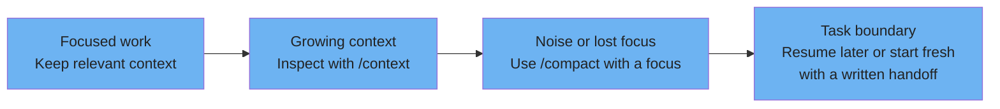
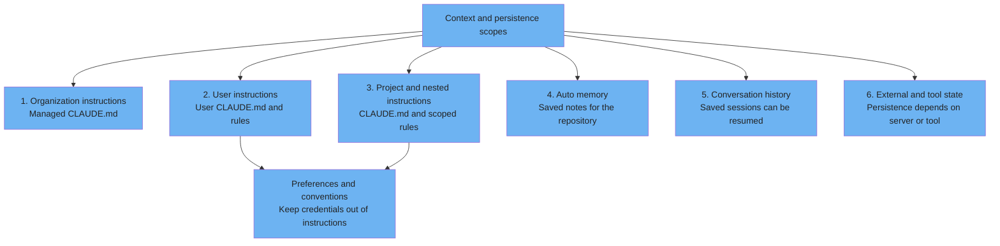
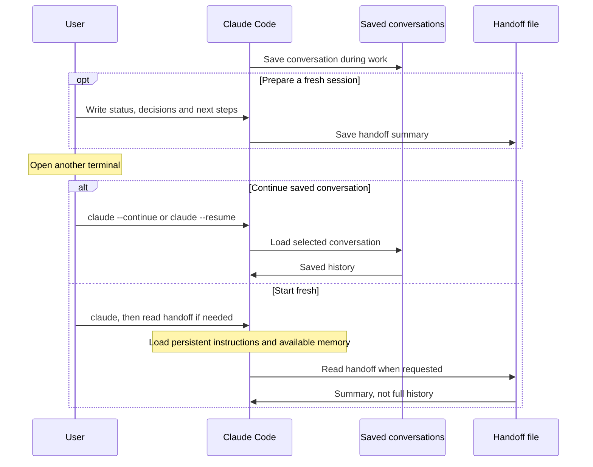

# Context & sessions

Context management recommendations, persistent instructions and session continuity.

---

### Context management zones

These four situations are an author workflow for managing context, not native percentage zones or permission states. Claude manages context automatically; no universal auto-compaction percentage is asserted here.



<details>
<summary>ASCII version</summary>

```
Focused work   -> Growing context    -> Noise or lost focus -> Task boundary
Relevant input    Inspect /context      /compact with focus    Resume or start fresh

Author recommendations, not fixed percentages or reduced tool permissions.
Automatic context management does not guarantee every detail survives.
```

</details>

> **Source**: [Context management](../ultimate-guide.md#22-context-management)
>
> **Official reference**: [Manage context](https://code.claude.com/docs/en/best-practices#manage-context-aggressively) and [automatic compaction](https://code.claude.com/docs/en/how-claude-code-works#when-context-fills-up).

---

### Memory hierarchy (6 types)

This six-part teaching taxonomy separates persistent instructions, learned notes, conversation history and external state. It is not a six-level configuration override stack. CLAUDE.md and rules shape context; they do not enforce tool permissions.



<details>
<summary>ASCII version</summary>

```
1. Organization instructions       managed CLAUDE.md
2. User instructions               user CLAUDE.md and rules
3. Project / nested instructions    CLAUDE.md and scoped rules
4. Auto memory                     saved repository notes
5. Conversation history            saved sessions, resumable
6. External / tool state           persistence depends on implementation

Instruction scopes are not permission enforcement or a strict override stack.
Store preferences and conventions in instructions, not API keys or tokens.
```

</details>

> **Source**: [Memory files](../ultimate-guide.md#31-memory-files-claudemd)
>
> **Official reference**: [Instruction files and auto memory](https://code.claude.com/docs/en/memory#claude-md-vs-auto-memory), [session resume](https://code.claude.com/docs/en/common-workflows#resume-previous-conversations), and [credential storage](https://code.claude.com/docs/en/security#additional-safeguards).
>
> Nested instructions and conditional rules can load when relevant files are accessed. Use managed settings, permissions and hooks for enforced policy.

---

### Session continuity: Saving and resuming state

Claude Code saves conversations. Reopening a terminal can resume a saved session, or start a fresh conversation with persistent instructions and an optional handoff. A handoff summarizes progress; it does not restore every message.



<details>
<summary>ASCII version</summary>

```
Work -> conversation saved
  |
  +-> claude --continue / claude --resume -> saved conversation resumes
  |
  +-> write handoff -> start claude fresh -> read handoff summary
      Fresh session also loads persistent instructions and available memory.
      The summary is not the full conversation history.
```

</details>

> **Source**: [Session continuation and resume](../ultimate-guide.md#session-continuation-and-resume)
>
> **Official reference**: [Resume saved conversations](https://code.claude.com/docs/en/common-workflows#resume-previous-conversations).

---

### Fresh context anti-pattern vs. best practice

Unrelated tasks can fill a session with irrelevant history. The author recommendation is to work in focused sessions, use compaction when useful, and preserve a handoff before starting fresh. Saved conversations remain available for resume.

```mermaid
flowchart TD
    subgraph BAD[Unfocused session]
        B1[Task A] --> B2[Unrelated task B]
        B2 --> B3[Unrelated task C]
        B3 --> B4[More irrelevant context<br/>Harder to retain instructions]
    end
    subgraph GOOD[Focused workflow]
        G1[Work on task A] --> G2{Natural checkpoint?}
        G2 -->|Yes| G3[Save handoff or resume later]
        G3 --> G4[Fresh session for unrelated task B]
        G2 -->|No| G5{Context needs cleanup?}
        G5 -->|Yes| G6["/compact with a focus"]
        G6 --> G1
        G5 -->|No| G1
    end
    style B1 fill:#6DB3F2,color:#222
    click B1 href "https://github.com/FlorianBruniaux/claude-code-ultimate-guide/blob/main/guide/ultimate-guide.md#22-context-management" "Context management"
    style B2 fill:#6DB3F2,color:#222
    click B2 href "https://github.com/FlorianBruniaux/claude-code-ultimate-guide/blob/main/guide/ultimate-guide.md#22-context-management" "Context management"
    style B3 fill:#6DB3F2,color:#222
    click B3 href "https://github.com/FlorianBruniaux/claude-code-ultimate-guide/blob/main/guide/ultimate-guide.md#22-context-management" "Context management"
    style B4 fill:#6DB3F2,color:#222
    click B4 href "https://github.com/FlorianBruniaux/claude-code-ultimate-guide/blob/main/guide/ultimate-guide.md#22-context-management" "Context management"
    style G1 fill:#6DB3F2,color:#222
    click G1 href "https://github.com/FlorianBruniaux/claude-code-ultimate-guide/blob/main/guide/ultimate-guide.md#22-context-management" "Context management"
    style G2 fill:#6DB3F2,color:#222
    click G2 href "https://github.com/FlorianBruniaux/claude-code-ultimate-guide/blob/main/guide/ultimate-guide.md#22-context-management" "Context management"
    style G3 fill:#6DB3F2,color:#222
    click G3 href "https://github.com/FlorianBruniaux/claude-code-ultimate-guide/blob/main/guide/ultimate-guide.md#22-context-management" "Context management"
    style G4 fill:#6DB3F2,color:#222
    click G4 href "https://github.com/FlorianBruniaux/claude-code-ultimate-guide/blob/main/guide/ultimate-guide.md#22-context-management" "Context management"
    style G5 fill:#6DB3F2,color:#222
    click G5 href "https://github.com/FlorianBruniaux/claude-code-ultimate-guide/blob/main/guide/ultimate-guide.md#22-context-management" "Context management"
    style G6 fill:#6DB3F2,color:#222
    click G6 href "https://github.com/FlorianBruniaux/claude-code-ultimate-guide/blob/main/guide/ultimate-guide.md#22-context-management" "Context management"
```



<details>
<summary>ASCII version</summary>

```
Unfocused: Task A -> unrelated B -> unrelated C -> irrelevant context accumulates
Focused:   Task A -> checkpoint -> handoff or resume later -> fresh session for B
                   no checkpoint -> inspect context -> /compact if useful -> continue

Starting fresh does not erase the saved conversation.
No fixed percentage guarantees response quality.
```

</details>

> **Source**: [Context management](../ultimate-guide.md#22-context-management)
>
> **Official reference**: [Context recommendations](https://code.claude.com/docs/en/best-practices#manage-context-aggressively).
