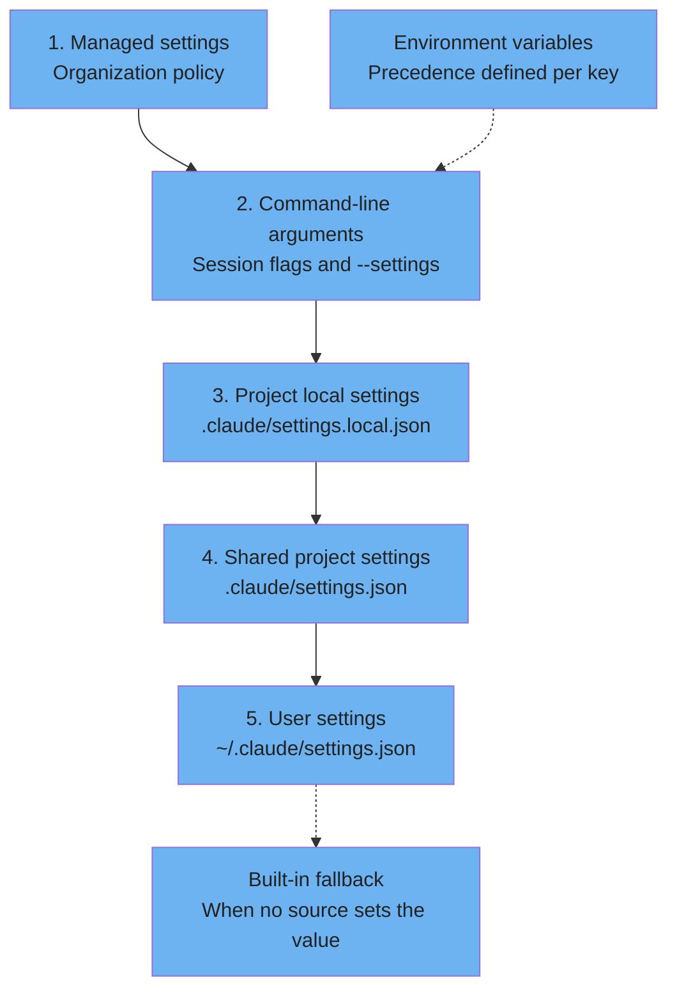
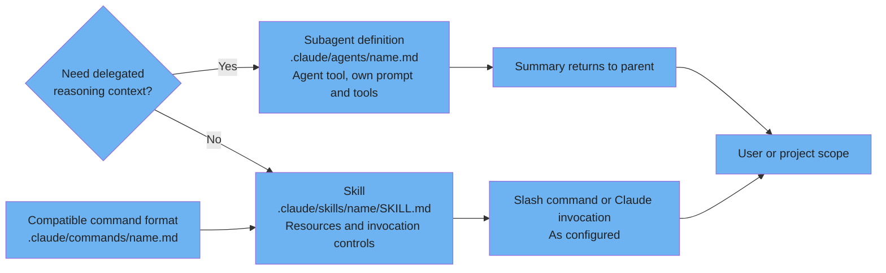
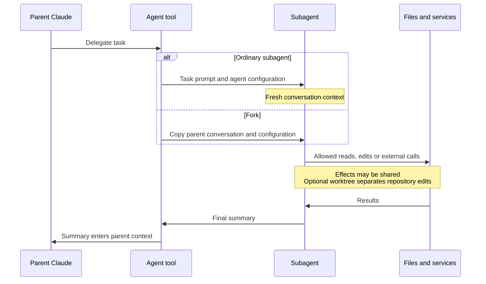
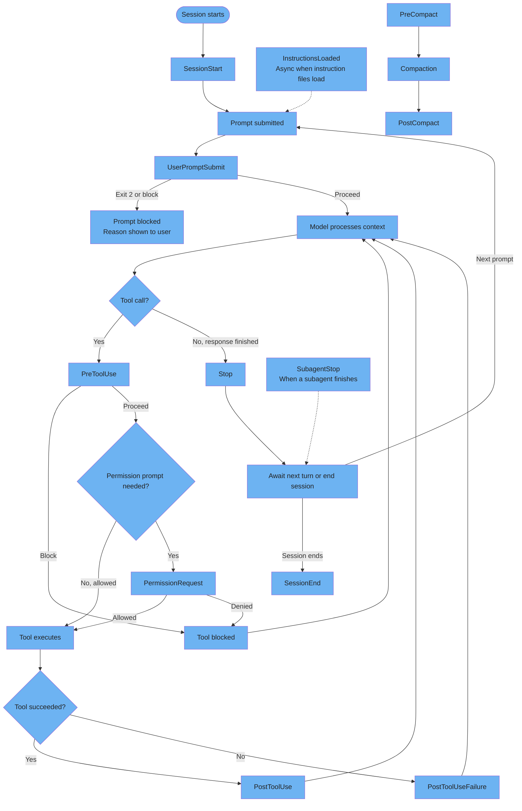

# Configuration system

Documented settings precedence and a simplified view of extensibility and hooks.

---

### Configuration precedence (5 levels)

For the same settings key, the documented stack has five levels, highest first. Lists may merge and security-sensitive exceptions apply. Environment-variable precedence is defined per setting; CLAUDE.md belongs to instruction context, not this settings stack.



<details>
<summary>ASCII version</summary>

```
Highest precedence
1. Managed settings
2. Command-line arguments
3. .claude/settings.local.json
4. .claude/settings.json
5. ~/.claude/settings.json
Fallback: built-in value when not configured

Environment variables: resolve per key, not as a universal sixth level.
CLAUDE.md: instructions, outside this settings stack.
Lists can merge; consult documented security-sensitive exceptions.
```

</details>

> **Source**: [Precedence rules](../ultimate-guide.md#34-precedence-rules)
>
> **Official reference**: [Settings precedence](https://code.claude.com/docs/en/settings#settings-precedence) and [environment-variable precedence](https://code.claude.com/docs/en/env-vars#precedence).
>
> For model selection the variable is ANTHROPIC_MODEL. CLAUDE_CONFIG_DIR changes the configuration directory. A CLI model selection remains constrained by managed availableModels; it does not override organizational policy.

---

### Skills vs. commands vs. agents: When to use each

Custom commands have been merged into skills. Both file formats create a slash command; skills also support bundled resources and invocation by Claude. Subagents use a separate context window for delegated work. User and project scopes exist for these mechanisms.



<details>
<summary>ASCII version</summary>

```
Reusable instructions / workflow:
  .claude/skills/name/SKILL.md -> /name, or Claude invocation as configured
  .claude/commands/name.md    -> compatible /name format
  Both can use user or project scope.

Delegated work:
  .claude/agents/name.md -> Agent tool -> own context, prompt and permitted tools
  Summary returns to parent; file/service effects can be shared.
```

</details>

> **Source**: [Understanding skills](../ultimate-guide.md#51-understanding-skills)
>
> **Official reference**: [Skills and command compatibility](https://code.claude.com/docs/en/skills) and [subagent definitions](https://code.claude.com/docs/en/sub-agents).

---

### Agent lifecycle & scope isolation

A separate context window keeps intermediate tool activity out of the parent conversation. It does not isolate file or service effects. Ordinary subagents start fresh; forks inherit the conversation. A worktree can separate repository edits.



<details>
<summary>ASCII version</summary>

```
Parent -> Agent tool -> Subagent
  Ordinary: task prompt + definition; fresh conversation context
  Fork:     inherits parent conversation and configuration
  Tools:    permitted file/service operations; effects may be shared
  Optional worktree: separate repository checkout, not isolated external services
Subagent -> final summary -> parent context
```

</details>

> **Source**: [Sub-agent architecture](../core/architecture.md#4-sub-agent-architecture)
>
> **Official reference**: [Forks and ordinary subagents](https://code.claude.com/docs/en/sub-agents#how-forks-differ-from-other-subagents).

---

### Hooks event pipeline

This simplified lifecycle distinguishes session events, turn events and tool events. PermissionRequest is conditional. Hook types and decision controls vary by event; this is not the exhaustive event inventory.



<details>
<summary>ASCII version</summary>

```
SessionStart -> prompt -> UserPromptSubmit
  blocked (exit 2 / decision): reason shown to user; prompt not processed
  proceed -> model processes context -> tool call?
    no, response finished -> Stop -> next turn or SessionEnd
    yes -> PreToolUse -> permissions check
              blocked -> tool blocked -> model
              prompt needed -> PermissionRequest -> allow / deny
              already allowed -> execute
  tool success -> PostToolUse -> model
  tool failure -> PostToolUseFailure -> model

Separate events: InstructionsLoaded (async), SubagentStop
Compaction: PreCompact -> compaction -> PostCompact
Hook types: command, http, mcp_tool, prompt, agent; support depends on event.
```

</details>

> **Source**: [The event system](../ultimate-guide.md#71-the-event-system)
>
> **Official reference**: [Hook lifecycle and decisions](https://code.claude.com/docs/en/hooks#hook-lifecycle).
>
> InstructionsLoaded also fires on lazy instruction loading. Stop is per response, SessionEnd is per session; API errors have StopFailure. Some special tools skip normal tool hooks. The official reference lists these exceptions and each event's supported hook types.
