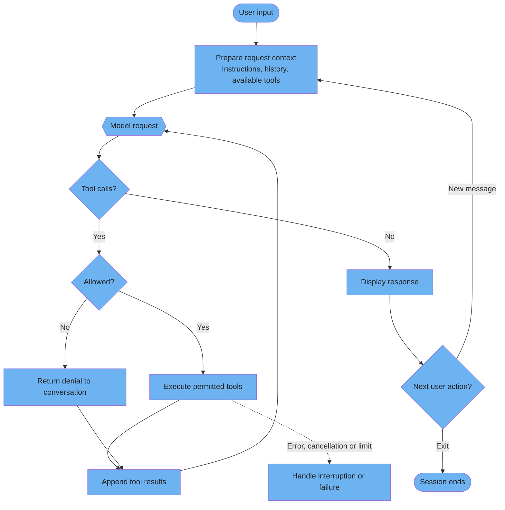
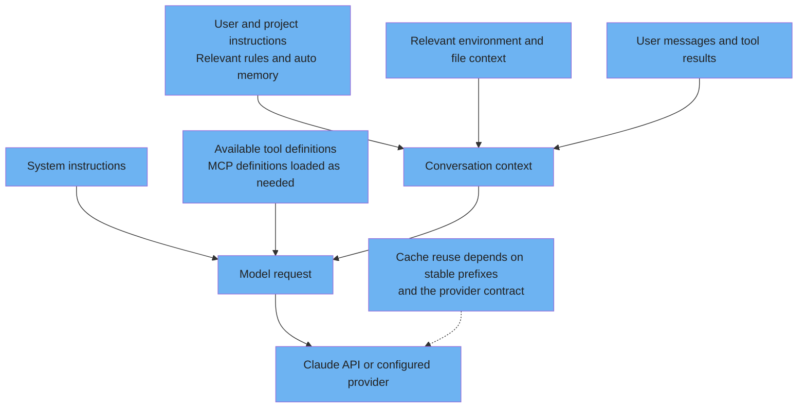
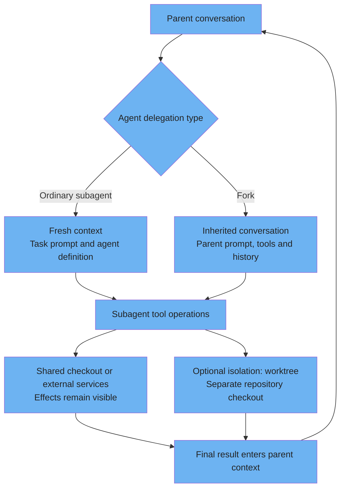

# Architecture internals

Conceptual diagrams of the model-and-tool loop, tool families and context boundaries.

---

### The master loop

A simplified model-and-tool loop: Claude requests tools, permitted operations run, and their results return to the conversation. Turns can also end because of errors, cancellation or limits. Independent operations may run concurrently; no fixed concurrency limit is asserted.



<details>
<summary>ASCII version</summary>

```
User input -> request context -> model
                    ^             |
                    |        tool calls?
                    |          Yes -> permissions -> execute or deny -> append result
                    +-------------------------------------------------------------+
                               No -> display response -> next message or exit
Errors, cancellation and limits can interrupt the loop.
Independent operations may run concurrently.
```

</details>

> **Source**: [The master loop](../core/architecture.md#1-the-master-loop)
>
> **Official reference**: [Documented agentic loop](https://code.claude.com/docs/en/how-claude-code-works#the-agentic-loop).

---

### Tool categories & selection

These six author-defined categories organize examples from the documented tool inventory. Availability varies by Claude Code version, model, surface and configuration; this is not a complete tool list or a native six-category taxonomy.

```mermaid
flowchart TD
    ROOT[Illustrative tool families] --> READ[Read and search<br/>Glob, Grep, Read]
    ROOT --> WRITE[Modify files<br/>Write, Edit, NotebookEdit]
    ROOT --> EXEC[Execute and delegate<br/>Bash, Agent]
    ROOT --> WEB[Web access<br/>WebSearch, WebFetch]
    ROOT --> TRACK[Track tasks when available<br/>TaskCreate, TaskGet,<br/>TaskList, TaskUpdate]
    ROOT --> CONTROL[Control workflow<br/>EnterPlanMode, ExitPlanMode,<br/>EnterWorktree, ExitWorktree,<br/>AskUserQuestion]
    style ROOT fill:#6DB3F2,color:#222
    click ROOT href "https://github.com/FlorianBruniaux/claude-code-ultimate-guide/blob/main/guide/core/architecture.md#2-the-tool-arsenal" "The tool arsenal"
    style READ fill:#6DB3F2,color:#222
    click READ href "https://github.com/FlorianBruniaux/claude-code-ultimate-guide/blob/main/guide/core/architecture.md#2-the-tool-arsenal" "The tool arsenal"
    style WRITE fill:#6DB3F2,color:#222
    click WRITE href "https://github.com/FlorianBruniaux/claude-code-ultimate-guide/blob/main/guide/core/architecture.md#2-the-tool-arsenal" "The tool arsenal"
    style EXEC fill:#6DB3F2,color:#222
    click EXEC href "https://github.com/FlorianBruniaux/claude-code-ultimate-guide/blob/main/guide/core/architecture.md#2-the-tool-arsenal" "The tool arsenal"
    style WEB fill:#6DB3F2,color:#222
    click WEB href "https://github.com/FlorianBruniaux/claude-code-ultimate-guide/blob/main/guide/core/architecture.md#2-the-tool-arsenal" "The tool arsenal"
    style TRACK fill:#6DB3F2,color:#222
    click TRACK href "https://github.com/FlorianBruniaux/claude-code-ultimate-guide/blob/main/guide/core/architecture.md#2-the-tool-arsenal" "The tool arsenal"
    style CONTROL fill:#6DB3F2,color:#222
    click CONTROL href "https://github.com/FlorianBruniaux/claude-code-ultimate-guide/blob/main/guide/core/architecture.md#2-the-tool-arsenal" "The tool arsenal"
```



<details>
<summary>ASCII version</summary>

```
READ / SEARCH : Glob, Grep, Read
MODIFY        : Write, Edit, NotebookEdit
EXECUTE       : Bash, Agent
WEB           : WebSearch, WebFetch
TASK TRACKING : TaskCreate, TaskGet, TaskList, TaskUpdate when available
CONTROL       : EnterPlanMode / ExitPlanMode, EnterWorktree / ExitWorktree,
                AskUserQuestion

Illustrative families, not a complete or universally available inventory.
List directories through a shell command; consult the current tools reference.
```

</details>

> **Source**: [The tool arsenal](../core/architecture.md#2-the-tool-arsenal)
>
> **Official reference**: [Current tools and availability](https://code.claude.com/docs/en/tools-reference).
>
> TodoWrite is an alternative checklist tool in supported configurations, not a universally active default. Agent is the current subagent tool name; Task remains an alias in settings and definitions.

---

### System prompt assembly

This conceptual request diagram groups stable instructions with changing conversation context. It does not specify the exact internal assembly order, cache breakpoints or when every input is reread. Instruction files and memory may enter conversation context; MCP definitions can load on demand.



<details>
<summary>ASCII version</summary>

```
System instructions --------------------+
Available / loaded tool definitions -----+--> Model request -> configured provider
Conversation context --------------------+
  - relevant instruction files, rules and available memory
  - environment and file information
  - messages and tool results

Conceptual grouping; not the literal prompt order or cache layout.
Cache isolation and reuse follow the provider contract.
```

</details>

> **Source**: [System prompt contents](../core/architecture.md#system-prompt-contents)
>
> **Official reference**: [Context loading](https://code.claude.com/docs/en/how-claude-code-works#context-claude-code-adds-on-its-own) and [cache isolation](https://platform.claude.com/docs/en/build-with-claude/prompt-caching#cache-storage-and-sharing).
>
> Public Anthropic API caches are not shared across organizations. Workspace isolation also applies on providers identified in the caching documentation. No cross-user or cross-organization reuse of private CLAUDE.md content is asserted.

---

### Sub-Agent context isolation

Conversation isolation and filesystem isolation are different boundaries. An ordinary subagent has fresh context; a fork inherits the parent conversation. Both return a final result while permitted operations may affect shared files or external services.



<details>
<summary>ASCII version</summary>

```
Parent -> Agent
  ordinary -> fresh context with delegated task and definition
  fork     -> inherited parent conversation and configuration
       |
       +-> shared files and external services: permitted effects persist
       +-> optional worktree: separate checkout for repository edits
       |
       +-> final result enters parent context

Intermediate tool calls stay out of parent context.
A worktree does not isolate external services.
```

</details>

> **Source**: [Sub-agent architecture](../core/architecture.md#4-sub-agent-architecture)
>
> **Official reference**: [Fork context and optional worktree isolation](https://code.claude.com/docs/en/sub-agents#how-forks-differ-from-other-subagents).
