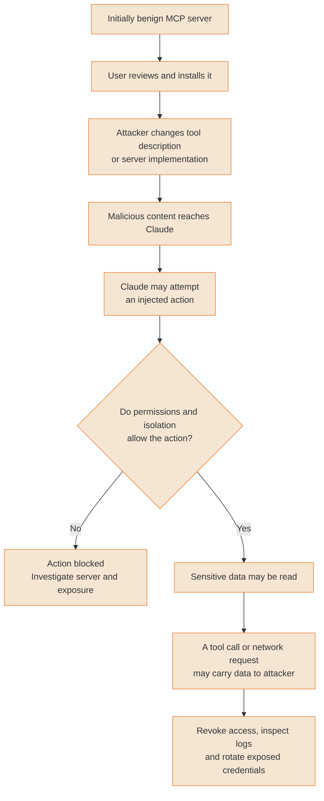
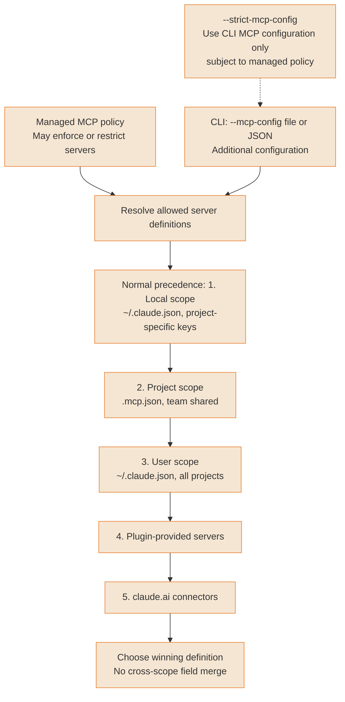

# MCP ecosystem

The Model Context Protocol extends Claude Code with external tool servers. These diagrams distinguish current protocol behavior from recommended safeguards.

---

### MCP server ecosystem map

Group servers by their maintainer and purpose. Provider-maintained servers and MCP reference examples have different support expectations. Neither category guarantees a security audit by Anthropic. The old standalone Semgrep MCP repository is deprecated; its server is maintained through the official Semgrep binary.

```mermaid
flowchart TD
    CC["Claude Code<br/>MCP client"] --> REF["MCP reference examples<br/>Educational, evaluate before production"]
    CC --> PROVIDER["Provider-maintained servers"]
    CC --> COMMUNITY["Community servers<br/>Verify exact repository and maintainer"]
    CC --> CUSTOM["Local or internal servers<br/>Project tools and API wrappers"]
    REF --> GIT["mcp-server-git<br/>Local Git operations"]
    REF --> THINK["sequential-thinking<br/>Reasoning example"]
    PROVIDER --> CTX["Context7 / Upstash<br/>Library documentation"]
    PROVIDER --> PLAY["Playwright / Microsoft<br/>Browser automation"]
    PROVIDER --> GH["GitHub MCP / GitHub<br/>Platform tools"]
    PROVIDER --> SEM["Semgrep official binary<br/>Security scanning"]
    PROVIDER --> AWS["AWS Labs MCP servers<br/>AWS tools"]
    COMMUNITY --> VET["Check maintenance, permissions<br/>and pinned version before install"]
    classDef default fill:#F5E6D3,color:#333,stroke:#E87E2F
    click CC href "https://github.com/FlorianBruniaux/claude-code-ultimate-guide/blob/main/guide/ecosystem/mcp-servers-ecosystem.md" "View this pattern in the guide"
    click REF href "https://github.com/FlorianBruniaux/claude-code-ultimate-guide/blob/main/guide/ecosystem/mcp-servers-ecosystem.md" "View this pattern in the guide"
    click PROVIDER href "https://github.com/FlorianBruniaux/claude-code-ultimate-guide/blob/main/guide/ecosystem/mcp-servers-ecosystem.md" "View this pattern in the guide"
    click COMMUNITY href "https://github.com/FlorianBruniaux/claude-code-ultimate-guide/blob/main/guide/ecosystem/mcp-servers-ecosystem.md" "View this pattern in the guide"
    click CUSTOM href "https://github.com/FlorianBruniaux/claude-code-ultimate-guide/blob/main/guide/ecosystem/mcp-servers-ecosystem.md" "View this pattern in the guide"
    click GIT href "https://github.com/FlorianBruniaux/claude-code-ultimate-guide/blob/main/guide/ecosystem/mcp-servers-ecosystem.md" "View this pattern in the guide"
    click THINK href "https://github.com/FlorianBruniaux/claude-code-ultimate-guide/blob/main/guide/ecosystem/mcp-servers-ecosystem.md" "View this pattern in the guide"
    click CTX href "https://github.com/FlorianBruniaux/claude-code-ultimate-guide/blob/main/guide/ecosystem/mcp-servers-ecosystem.md" "View this pattern in the guide"
    click PLAY href "https://github.com/FlorianBruniaux/claude-code-ultimate-guide/blob/main/guide/ecosystem/mcp-servers-ecosystem.md" "View this pattern in the guide"
    click GH href "https://github.com/FlorianBruniaux/claude-code-ultimate-guide/blob/main/guide/ecosystem/mcp-servers-ecosystem.md" "View this pattern in the guide"
    click SEM href "https://github.com/FlorianBruniaux/claude-code-ultimate-guide/blob/main/guide/ecosystem/mcp-servers-ecosystem.md" "View this pattern in the guide"
    click AWS href "https://github.com/FlorianBruniaux/claude-code-ultimate-guide/blob/main/guide/ecosystem/mcp-servers-ecosystem.md" "View this pattern in the guide"
    click VET href "https://github.com/FlorianBruniaux/claude-code-ultimate-guide/blob/main/guide/ecosystem/mcp-servers-ecosystem.md" "View this pattern in the guide"
```



<details>
<summary>ASCII version</summary>

```
Claude Code
├─ MCP reference examples: mcp-server-git, sequential-thinking
│  Educational examples; evaluate safeguards for your use case
├─ Provider maintained: Context7 (Upstash), Playwright (Microsoft),
│  GitHub MCP (GitHub), Semgrep binary, AWS Labs servers
├─ Community: identify repository, maintainer and maintained version
└─ Local/custom: project tools and internal API wrappers

Provider maintained does not imply Anthropic security audit.
Semgrep's old standalone MCP repository is deprecated.
```

</details>

> **Source**: [Guide: MCP server ecosystem map](../ecosystem/mcp-servers-ecosystem.md); [MCP reference servers](https://github.com/modelcontextprotocol/servers), [Context7](https://github.com/upstash/context7), [Playwright MCP](https://github.com/microsoft/playwright-mcp), [GitHub MCP](https://github.com/github/github-mcp-server), [Semgrep migration notice](https://github.com/semgrep/mcp), [AWS Labs MCP](https://github.com/awslabs/mcp)

---

### MCP architecture: Client-Server protocol

MCP uses JSON-RPC. Standard transports are stdio and Streamable HTTP; the historical SSE transport remains supported by Claude Code but is deprecated. Streamable HTTP can itself stream replies using SSE. The diagram illustrates a tool-call exchange, not every MCP capability.

```mermaid
flowchart LR
    CALL["Claude requests a tool"] --> MATCH["Claude Code matches<br/>the tool to its server"]
    MATCH --> REQ["JSON-RPC tools/call<br/>params.name + params.arguments"]
    REQ --> TRANS["stdio or Streamable HTTP<br/>Legacy SSE deprecated"]
    TRANS --> EXEC["MCP server executes action<br/>API, file or CLI"]
    EXEC --> EXT["External service<br/>if required"]
    EXT --> RESULT["JSON-RPC response<br/>result or protocol error"]
    EXEC --> RESULT
    RESULT --> USE["Claude Code provides tool result<br/>to the next model turn"]
    classDef default fill:#F5E6D3,color:#333,stroke:#E87E2F
    click CALL href "https://github.com/FlorianBruniaux/claude-code-ultimate-guide/blob/main/guide/core/architecture.md#mcp-architecture-overview" "View this pattern in the guide"
    click MATCH href "https://github.com/FlorianBruniaux/claude-code-ultimate-guide/blob/main/guide/core/architecture.md#mcp-architecture-overview" "View this pattern in the guide"
    click REQ href "https://github.com/FlorianBruniaux/claude-code-ultimate-guide/blob/main/guide/core/architecture.md#mcp-architecture-overview" "View this pattern in the guide"
    click TRANS href "https://github.com/FlorianBruniaux/claude-code-ultimate-guide/blob/main/guide/core/architecture.md#mcp-architecture-overview" "View this pattern in the guide"
    click EXEC href "https://github.com/FlorianBruniaux/claude-code-ultimate-guide/blob/main/guide/core/architecture.md#mcp-architecture-overview" "View this pattern in the guide"
    click EXT href "https://github.com/FlorianBruniaux/claude-code-ultimate-guide/blob/main/guide/core/architecture.md#mcp-architecture-overview" "View this pattern in the guide"
    click RESULT href "https://github.com/FlorianBruniaux/claude-code-ultimate-guide/blob/main/guide/core/architecture.md#mcp-architecture-overview" "View this pattern in the guide"
    click USE href "https://github.com/FlorianBruniaux/claude-code-ultimate-guide/blob/main/guide/core/architecture.md#mcp-architecture-overview" "View this pattern in the guide"
```



<details>
<summary>ASCII version</summary>

```
Claude requests tool → match server → JSON-RPC tools/call
                                      params.name + params.arguments
                                                │
                              stdio / Streamable HTTP
                              (legacy SSE deprecated)
                                                │
                                     Server executes action
                                     ↔ optional external service
                                                │
                               JSON-RPC result or protocol error
                                                │
                                Tool result → next model turn
```

</details>

> **Source**: [Guide: MCP architecture: Client-Server protocol](../core/architecture.md#mcp-architecture-overview); [MCP transport bindings](https://modelcontextprotocol.io/specification/2026-07-28/basic/transports), [tools/call wire format](https://modelcontextprotocol.io/specification/2026-07-28/server/tools#calling-tools), [Claude Code transports](https://code.claude.com/docs/en/mcp)

---

### MCP rug pull attack chain

A rug pull changes a previously trusted tool or server after installation. A malicious description can try to influence Claude, but reading it does not guarantee execution or exfiltration: permissions and process isolation may block the attempted action. Review source and updates, pin versions where possible, and restrict permissions and network access.



<details>
<summary>ASCII version</summary>

```
Initially benign server → reviewed and installed
            │
Attacker changes description or implementation
            │
Malicious content → possible injected action
            │
Permissions and isolation allow it?
├─ No  → blocked; investigate
└─ Yes → possible sensitive read
          → tool arguments / network request to attacker
          → revoke access, inspect logs, rotate exposed credentials

Source review, version pinning and least privilege reduce risk.
```

</details>

> **Source**: [Guide: MCP rug pull attack chain](../security/security-hardening.md#attack-mcp-rug-pull); [Claude Code MCP security](https://code.claude.com/docs/en/security#mcp-security)

---

### MCP config hierarchy

For duplicate server names, local scope precedes project scope, then user scope. Lower-priority plugin servers and claude.ai connectors are also checked for duplicates. CLI configuration is an additional input; use --strict-mcp-config when you intend to ignore other MCP sources, subject to managed policy. Server entries are selected rather than merged across scopes.



<details>
<summary>ASCII version</summary>

```
Managed MCP policy applies before relying on a configuration.
CLI input: --mcp-config file-or-JSON
  --strict-mcp-config ignores other MCP configurations,
  subject to managed MCP rules.

Normal duplicate resolution (highest → lowest):
1. Local scope   ~/.claude.json, current-project keys
2. Project scope .mcp.json
3. User scope    ~/.claude.json, all-project keys
4. Plugin servers
5. claude.ai connectors

Choose the winning entry; do not merge its fields across scopes.
```

</details>

> **Source**: [Guide: MCP config hierarchy](../ultimate-guide.md#83-configuration); [MCP precedence](https://code.claude.com/docs/en/mcp#scope-hierarchy-and-precedence), [CLI configuration flags](https://code.claude.com/docs/en/cli-reference)
