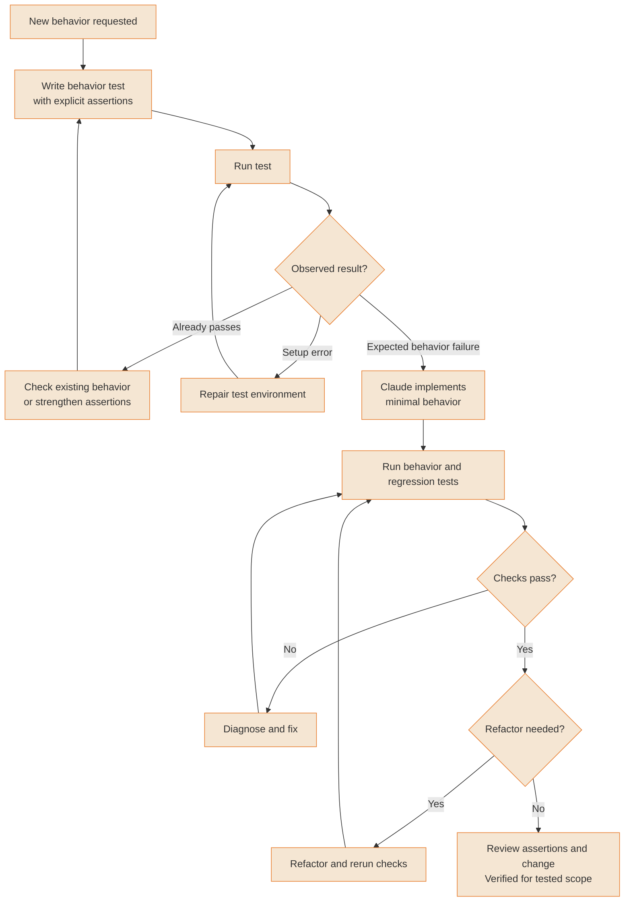
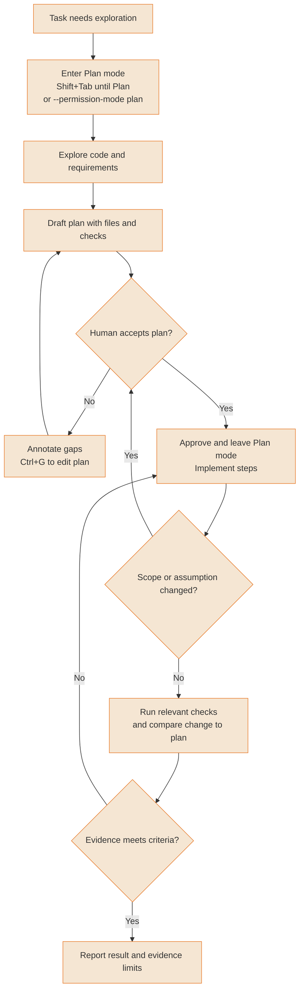
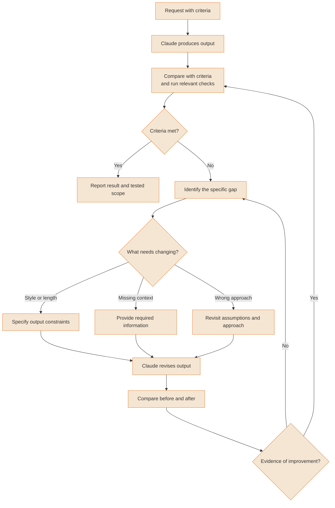
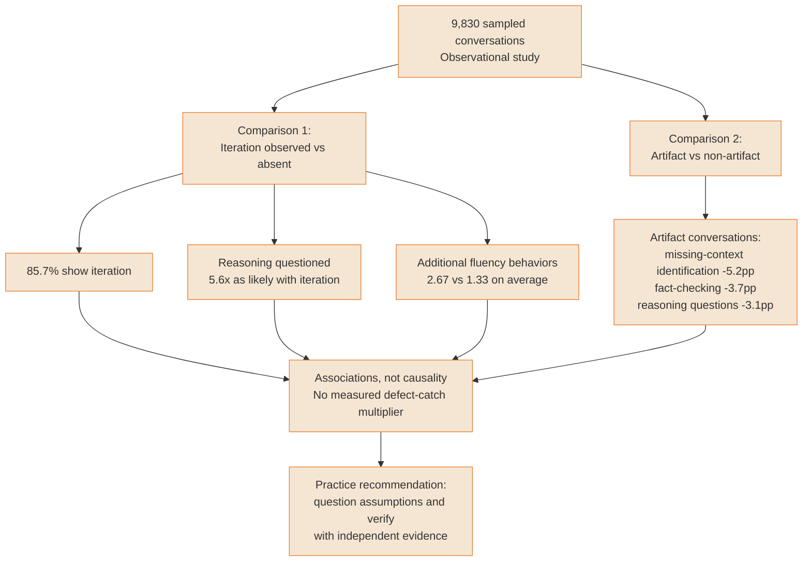

# Development workflows

Methods for structuring AI-assisted development. Their verification steps establish only the behavior and scope actually checked.

---

### TDD red-green-refactor with Claude

Write a behavior test, observe why it fails, implement the requested behavior, then refactor while keeping checks green. A passing test proves only its assertions. Confirm the feature is not already present when a new test passes before implementation, and distinguish expected failures from setup errors.



<details>
<summary>ASCII version</summary>

```
Write behavior test → run it
├─ Passes already → existing behavior? strengthen assertions if needed
├─ Setup failure  → fix environment, rerun
└─ Expected failure (RED) → implement minimal behavior
                            → run behavior + regression tests
                            ├─ Fail → diagnose and fix
                            └─ Pass (GREEN) → refactor if needed
                                              → rerun checks
                                              → review tested scope
```

</details>

> **Source**: [Guide: TDD red-green-refactor with Claude](../workflows/tdd-with-claude.md); [Verification criteria](https://code.claude.com/docs/en/best-practices)

---

### Spec-First development pipeline

A specification helps compare intended behavior with implementation; it does not guarantee that drift is impossible. The Maintain loop is a configured automation pattern: a deterministic trigger invokes Claude, an owner triages the resulting intent, and changes pass review and deployment gates. Claude Code does not start this monitoring loop merely because a spec file exists.

```mermaid
flowchart TD
    IDEA["Requirement"] --> INTENT["Write intent.md<br/>Problem, owner and constraints"]
    INTENT --> IA{"Intent approved by owner?"}
    IA -->|No| INTENT
    IA -->|Yes| SPEC["Write and clarify spec.md"]
    SPEC --> SA{"Human approves spec?"}
    SA -->|No| SPEC
    SA -->|Yes| TESTS["Generate behavior tests"]
    TESTS --> IMPL["Implement from spec and tests"]
    IMPL --> RUN["Run checks"]
    RUN --> PASS{"Checks pass?"}
    PASS -->|No| IMPL
    PASS -->|Yes| REVIEW{"Human review matches spec?"}
    REVIEW -->|No| FIX["Revise spec or implementation"]
    FIX --> RUN
    REVIEW -->|Yes| MERGE["Merge after review"]
    MERGE --> DEPLOY["Deployment gate and runtime checks"]
    DEPLOY --> MON["Configured monitoring<br/>Deterministic trigger"]
    MON --> BREACH{"Threshold crossed?"}
    BREACH -->|No| MON
    BREACH -->|Yes| DRAFT["Claude drafts intent.md"]
    DRAFT --> TRIAGE{"Service owner or on-call triages"}
    TRIAGE -->|Fix or schedule| INTENT
    TRIAGE -->|Dismiss| MON
    classDef default fill:#F5E6D3,color:#333,stroke:#E87E2F
    click IDEA href "https://github.com/FlorianBruniaux/claude-code-ultimate-guide/blob/main/guide/workflows/spec-first.md" "View this pattern in the guide"
    click INTENT href "https://github.com/FlorianBruniaux/claude-code-ultimate-guide/blob/main/guide/workflows/spec-first.md" "View this pattern in the guide"
    click IA href "https://github.com/FlorianBruniaux/claude-code-ultimate-guide/blob/main/guide/workflows/spec-first.md" "View this pattern in the guide"
    click SPEC href "https://github.com/FlorianBruniaux/claude-code-ultimate-guide/blob/main/guide/workflows/spec-first.md" "View this pattern in the guide"
    click SA href "https://github.com/FlorianBruniaux/claude-code-ultimate-guide/blob/main/guide/workflows/spec-first.md" "View this pattern in the guide"
    click TESTS href "https://github.com/FlorianBruniaux/claude-code-ultimate-guide/blob/main/guide/workflows/spec-first.md" "View this pattern in the guide"
    click IMPL href "https://github.com/FlorianBruniaux/claude-code-ultimate-guide/blob/main/guide/workflows/spec-first.md" "View this pattern in the guide"
    click RUN href "https://github.com/FlorianBruniaux/claude-code-ultimate-guide/blob/main/guide/workflows/spec-first.md" "View this pattern in the guide"
    click PASS href "https://github.com/FlorianBruniaux/claude-code-ultimate-guide/blob/main/guide/workflows/spec-first.md" "View this pattern in the guide"
    click REVIEW href "https://github.com/FlorianBruniaux/claude-code-ultimate-guide/blob/main/guide/workflows/spec-first.md" "View this pattern in the guide"
    click FIX href "https://github.com/FlorianBruniaux/claude-code-ultimate-guide/blob/main/guide/workflows/spec-first.md" "View this pattern in the guide"
    click MERGE href "https://github.com/FlorianBruniaux/claude-code-ultimate-guide/blob/main/guide/workflows/spec-first.md" "View this pattern in the guide"
    click DEPLOY href "https://github.com/FlorianBruniaux/claude-code-ultimate-guide/blob/main/guide/workflows/spec-first.md" "View this pattern in the guide"
    click MON href "https://github.com/FlorianBruniaux/claude-code-ultimate-guide/blob/main/guide/workflows/spec-first.md" "View this pattern in the guide"
    click BREACH href "https://github.com/FlorianBruniaux/claude-code-ultimate-guide/blob/main/guide/workflows/spec-first.md" "View this pattern in the guide"
    click DRAFT href "https://github.com/FlorianBruniaux/claude-code-ultimate-guide/blob/main/guide/workflows/spec-first.md" "View this pattern in the guide"
    click TRIAGE href "https://github.com/FlorianBruniaux/claude-code-ultimate-guide/blob/main/guide/workflows/spec-first.md" "View this pattern in the guide"
```



<details>
<summary>ASCII version</summary>

```
Requirement → owner-approved intent → human-approved spec
            → tests → implementation → checks
                           ↑             │ fail
                           └─────────────┘
Checks pass → human compares spec/output
├─ Mismatch → revise spec or code, rerun checks
└─ Match → review/merge → deployment gate + runtime checks
                          → configured monitoring
                          ├─ No threshold breach → continue
                          └─ Breach → Claude drafts intent
                                      → owner/on-call triage
                                      ├─ Fix/schedule → intent loop
                                      └─ Dismiss → monitoring
```

</details>

> **Source**: [Guide: Spec-First development pipeline](../workflows/spec-first.md); [Anthropic AI-native SDLC playbook](https://claude.com/resources/articles/the-ai-native-sdlc-playbook)

---

### Plan-Driven workflow with annotation

Use Plan mode to separate exploration from source edits. Cycle Shift+Tab until the status indicates Plan, or launch with --permission-mode plan; the number of keypresses depends on the starting mode. Review the plan, annotate it, then verify the implementation against it. This workflow is a review discipline, not a guarantee that every action will match the plan.



<details>
<summary>ASCII version</summary>

```
Task → Plan mode (Shift+Tab until Plan, or --permission-mode plan)
     → explore → propose plan → human review
                                 ├─ Revise → annotate, redraft
                                 └─ Accept → approve and implement
                                             ├─ Scope changed → review again
                                             └─ Run checks + compare to plan
                                                 → report evidence and limits
```

</details>

> **Source**: [Guide: Plan-Driven workflow with annotation](../workflows/plan-driven.md); [Explore, plan, implement](https://code.claude.com/docs/en/best-practices)

---

### Iterative refinement loop

Use specific feedback, compare revisions, and stop when explicit criteria are met. Appearance and satisfaction alone do not establish factual correctness; run checks appropriate to the output.



<details>
<summary>ASCII version</summary>

```
Request + criteria → output → evaluate and run relevant checks
                              ├─ Criteria met → report tested scope
                              └─ Gap → specific feedback
                                        ├─ Style/length constraints
                                        ├─ Missing context
                                        └─ Different approach
                                        → revision → compare
                                          ├─ Better → evaluate again
                                          └─ No gain → revisit gap
```

</details>

> **Source**: [Guide: Iterative refinement loop](../workflows/iterative-refinement.md); [Provide verification and context](https://code.claude.com/docs/en/best-practices)

---

### AI Fluency: Observed collaboration behaviors

Anthropic studied 9,830 Claude.ai conversations. Iteration appeared in 85.7% of the sample. Iterative conversations were 5.6 times as likely to show users questioning reasoning, with 2.67 versus 1.33 additional fluency behaviors. In artifact conversations, missing-context identification, fact-checking and reasoning questions were less frequent by 5.2, 3.7 and 3.1 percentage points. These are associations between conversation behaviors, not measured bug catches or proof that polished output causes acceptance bias.



<details>
<summary>ASCII version</summary>

```
9,830 sampled conversations (observational)
├─ Iteration observed vs absent
│  ├─ 85.7% show iteration
│  ├─ Questioning reasoning: 5.6x as likely with iteration
│  └─ Additional fluency behaviors: 2.67 vs 1.33 average
└─ Artifact vs non-artifact conversations
   ├─ Missing-context identification: -5.2 percentage points
   ├─ Fact-checking: -3.7 percentage points
   └─ Reasoning questions: -3.1 percentage points

Association does not establish causality or defects caught.
Recommendation: question assumptions, then verify with evidence.
```

</details>

> **Source**: [Guide: AI Fluency: Observed collaboration behaviors](../ultimate-guide.md#911-common-pitfalls--best-practices); [Anthropic AI Fluency Index](https://academy.claude.com/tutorials/the-ai-fluency-index)
