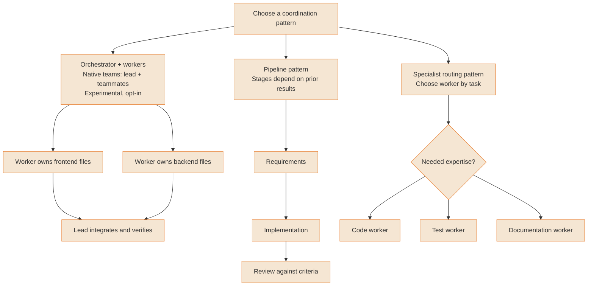
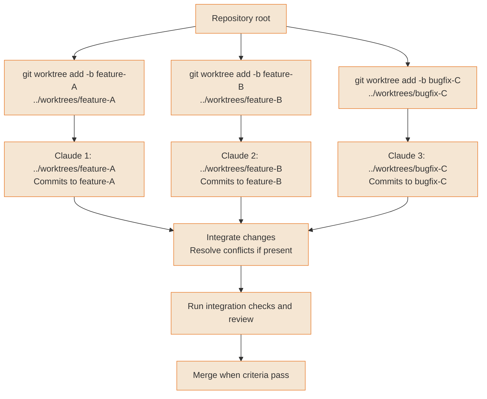
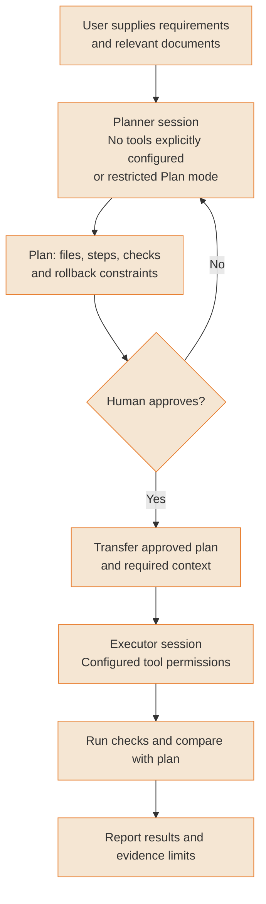
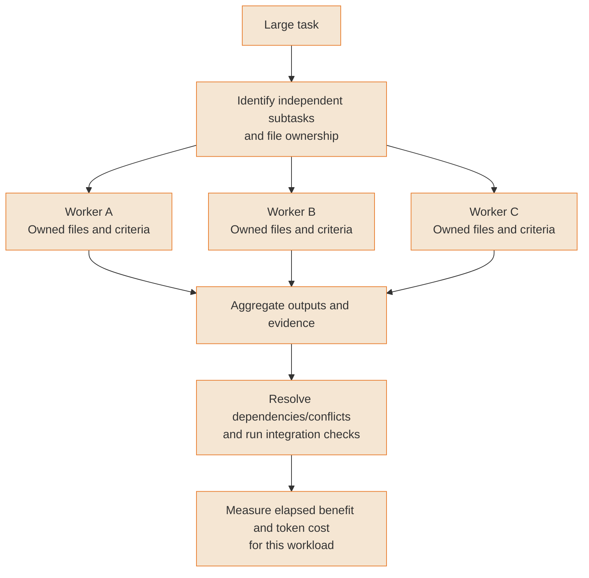
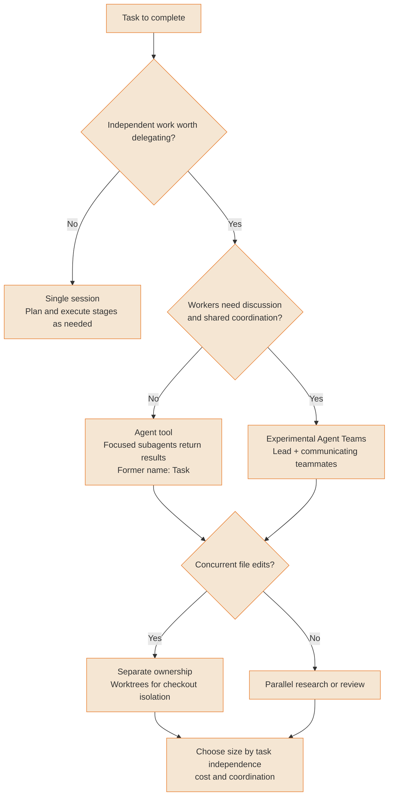
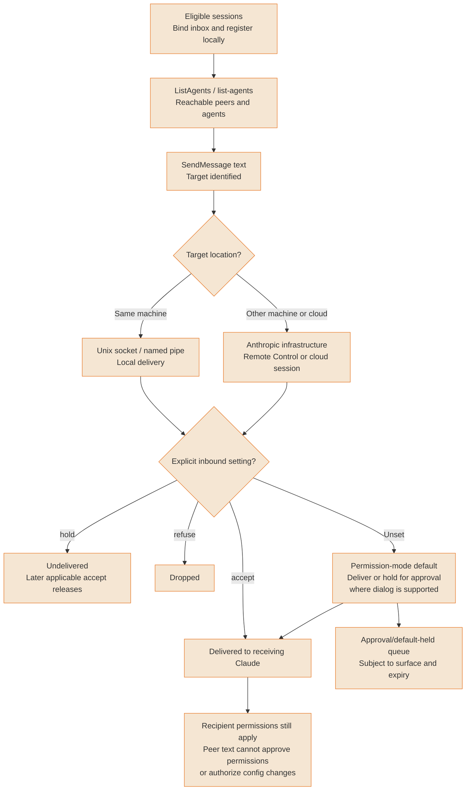

# Multi-agent patterns

Coordinate independent work with clear ownership and integration checks. Native features, conceptual patterns and measured outcomes are distinct.

---

### Agent teams: Conceptual orchestration topologies

Orchestrator, pipeline and specialist routing are conceptual patterns, not three native Agent Teams modes. Native Agent Teams uses a lead and communicating teammates; it is experimental and disabled by default. It adds coordination and token cost. Sequential tasks and edits to the same files often suit a single session or focused subagents better.



<details>
<summary>ASCII version</summary>

```
Conceptual coordination patterns
├─ Orchestrator → workers with explicit ownership → integration checks
│  Native Agent Teams: lead + communicating teammates, experimental opt-in
├─ Pipeline → requirements → implementation → review
│  Workflow pattern; often a single session or subagents suffices
└─ Router → needed specialist (code / tests / docs)
   Workflow pattern, not a dedicated native team mode

Teams cost more tokens and require coordination.
```

</details>

> **Source**: [Guide: Agent teams: Conceptual orchestration topologies](../workflows/agent-teams.md); [Agent Teams availability and trade-offs](https://code.claude.com/docs/en/agent-teams)

---

### Git worktree multi-instance pattern

Worktrees give concurrent instances separate checked-out files and branches. Some repository metadata remains shared, and integrating their changes can still produce merge conflicts. Commands below assume the cloned repository root; each command creates the displayed path.



<details>
<summary>ASCII version</summary>

```
From the cloned repository root:
git worktree add -b feature-A ../worktrees/feature-A
git worktree add -b feature-B ../worktrees/feature-B
git worktree add -b bugfix-C ../worktrees/bugfix-C

Each path → its Claude instance → commits on its own branch
         → integrate → resolve conflicts if present
         → integration checks + review → merge

Separate working files; shared repository metadata.
Concurrent editing is isolated, merge conflicts remain possible.
```

</details>

> **Source**: [Guide: Git worktree multi-instance pattern](../ultimate-guide.md#912-git-best-practices--workflows); [Git worktree semantics](https://git-scm.com/docs/git-worktree)

---

### Dual-Instance planning pattern

Use two sessions when a separate planning boundary is useful. A planner with no tools needs the relevant documents supplied in its prompt. Alternatively, Plan mode permits exploration with restricted actions. Configure the restriction explicitly; launching a second session does not disable tools. The executor needs the approved plan and required context, rather than inheriting the planner conversation automatically.



<details>
<summary>ASCII version</summary>

```
Supplied documents → planner
                     (explicit no-tools configuration,
                      or restricted Plan mode for exploration)
                   → plan → human review
                            ├─ Revise → planner
                            └─ Approve → transfer plan + required context
                                       → executor with configured tools
                                       → checks + result report

Two sessions alone do not enforce tool restrictions or transfer context.
```

</details>

> **Source**: [Guide: Dual-Instance planning pattern](../workflows/dual-instance-planning.md); [Plan permission mode](https://code.claude.com/docs/en/permissions), [Subagent tool restrictions](https://code.claude.com/docs/en/sub-agents)

---

### Horizontal scaling pattern

Parallelize independent work with explicit file ownership, then measure the result after coordination and integration. More instances do not guarantee proportional speedup; costs and dependencies can outweigh the benefit. Measure speedup and cost on the workload before making a performance claim.



<details>
<summary>ASCII version</summary>

```
Large task → independent subtasks with explicit ownership
            → parallel workers A / B / C
            → aggregate evidence
            → resolve dependencies and conflicts
            → integration checks
            → measure elapsed benefit and token cost

No guaranteed multiplier; coordination reduces gains.
```

</details>

> **Source**: [Guide: Horizontal scaling pattern](../ultimate-guide.md#917-scaling-patterns-multi-instance-workflows); [Team size, cost and diminishing returns](https://code.claude.com/docs/en/agent-teams)

---

### Multi-Instance decision matrix

Choose by dependency, communication and isolation needs before choosing a worker count. The native delegation tool is Agent; Task was its former name and remains a compatibility alias in settings and definitions. There is no four-instance prerequisite for using subagents.



<details>
<summary>ASCII version</summary>

```
Worth delegating independent work?
├─ No → single session, stages as needed
└─ Yes → need peer discussion / shared coordination?
         ├─ No → Agent tool subagents return results
         │       (Task is the historical compatibility alias)
         └─ Yes → experimental Agent Teams
                    │
         Concurrent file edits?
         ├─ Yes → file ownership + separate worktrees
         └─ No → parallel research/review
                    │
         Size by independence, cost and coordination, not a 4+ rule.
```

</details>

> **Source**: [Guide: Multi-Instance decision matrix](../ultimate-guide.md#917-scaling-patterns-multi-instance-workflows); [Agent tool rename and delegation](https://code.claude.com/docs/en/sub-agents), [Teams versus subagents](https://code.claude.com/docs/en/agent-teams)

---

### Cross-Session messaging: Discovery & delivery

Eligible independent sessions can discover peers with ListAgents and send text with SendMessage. Same-machine delivery uses local sockets or named pipes; other-machine and cloud delivery uses Anthropic infrastructure. Explicit crossSessionInbound hold retains messages until an applicable accept releases them. Approval dialogs belong to some permission-mode defaults in supported terminals, not to the explicit hold setting. Availability depends on version, provider and Remote Control requirements.



<details>
<summary>ASCII version</summary>

```
Eligible sessions → registry/inbox → ListAgents → SendMessage
Target location?
├─ Same machine → Unix socket / named pipe, local delivery
└─ Other machine/cloud → Anthropic infrastructure
                               │
Explicit crossSessionInbound?
├─ accept → delivered
├─ hold   → undelivered; later applicable accept releases
├─ refuse → dropped
└─ unset  → mode-dependent default
            ├─ deliver
            └─ approval hold, depending on terminal/surface and expiry

Peer text does not approve permissions or authorize configuration changes.
Version/provider/Remote Control requirements govern availability.
```

</details>

> **Source**: [Guide: Cross-Session messaging: Discovery & delivery](../workflows/cross-session-messaging.md); [Messaging controls and availability](https://code.claude.com/docs/en/cross-session-messaging)
