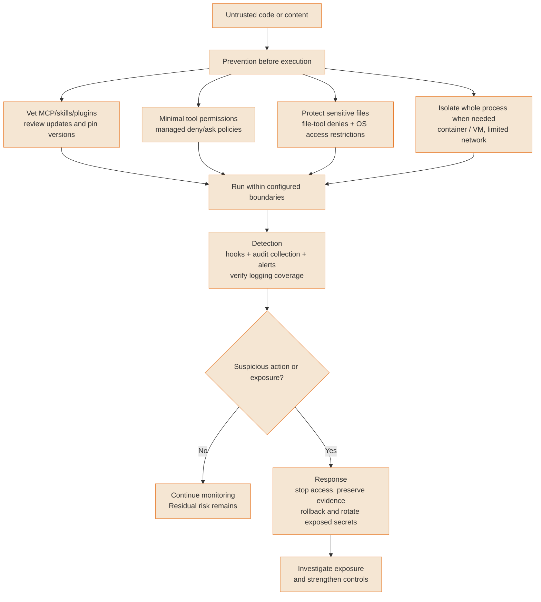
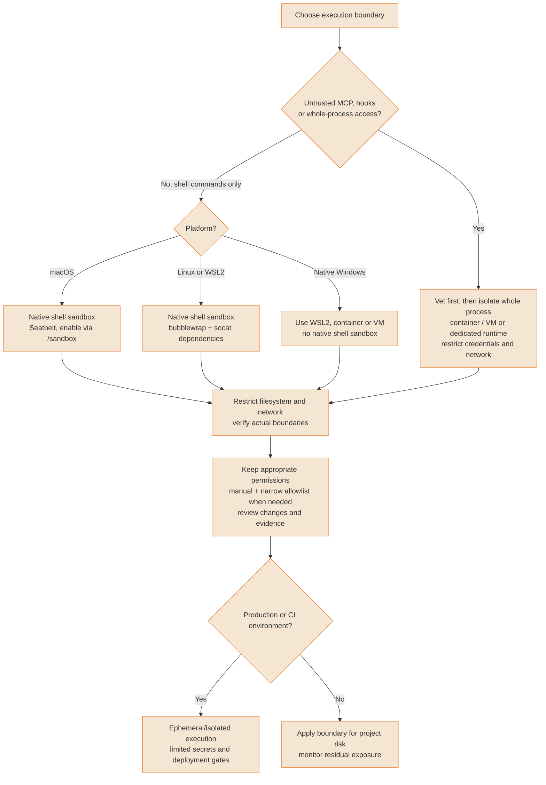
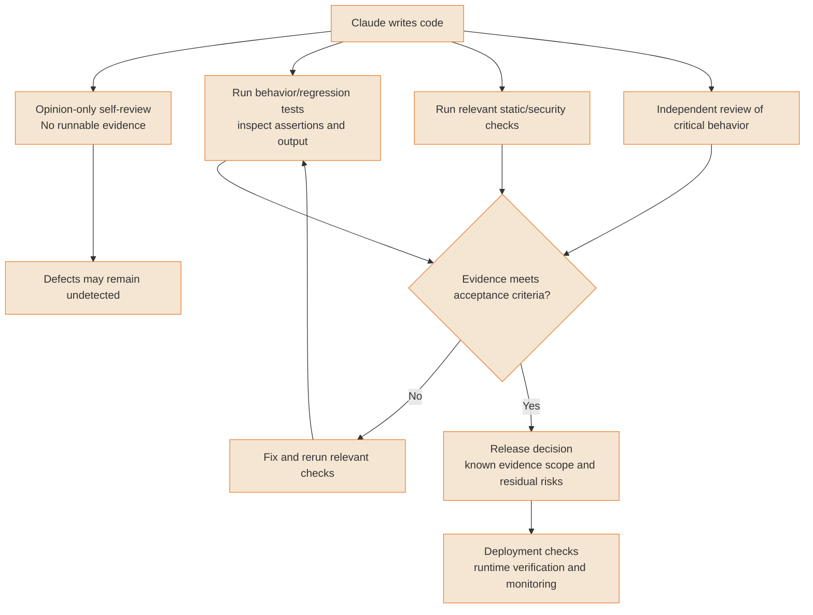
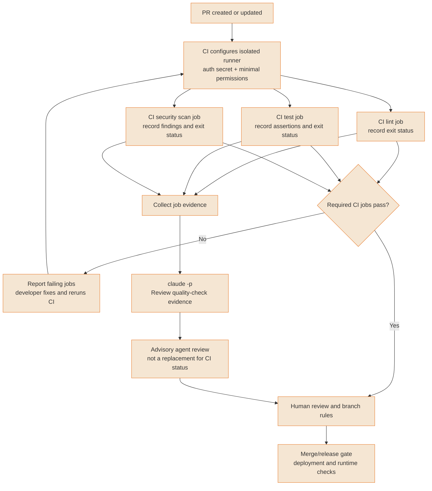

# Security & production

Use enforced execution boundaries and observed evidence when running Claude Code in sensitive environments. No diagram establishes universal containment or deployment safety.

---

### Security 3-layer defense model

Prevention, detection and response reduce different risks. Put enforced permissions and process isolation in place before running untrusted work. CLAUDE.md guides the model but does not enforce a security boundary. Sensitive-file protection needs file-tool permission rules and operating-system restrictions, not an assumed ignore-file feature. Logs must be configured and their coverage checked. Bypass permissions is appropriate only in an isolated environment, not merely because a job is labelled CI.



<details>
<summary>ASCII version</summary>

```
PREVENTION (before execution)
  Vet servers and updates; minimal permissions; managed policies
  File-tool denies + OS sensitive-file restrictions
  Whole-process isolation and limited network where needed
                        │
DETECTION
  Configured hooks/log collection/alerts; verify coverage
                        │
Suspicious action or exposure?
├─ No → monitor residual risk
└─ Yes → RESPONSE: stop access, preserve evidence,
                  rollback, rotate exposed secrets, investigate

CLAUDE.md guides behavior; it does not enforce a security boundary.
Bypass only in an isolated environment, not simply any CI job.
```

</details>

> **Source**: [Guide: Security 3-layer defense model](../security/security-hardening.md); [CLAUDE.md compliance limits](https://code.claude.com/docs/en/memory), [Permissions](https://code.claude.com/docs/en/permissions), [MCP security](https://code.claude.com/docs/en/security)

---

### Sandbox decision tree

Choose the boundary that covers the process at risk. The native shell sandbox supports macOS (Seatbelt) and Linux/WSL2 (bubblewrap and socat); native Windows needs WSL2 or another isolation environment. File tools, local MCP servers and hooks run outside the shell sandbox. Unknown MCP or hooks require vetting and, where needed, isolation of the entire Claude Code process. acceptEdits auto-approves edits, so it is not a stricter alternative to manual permissions. Native sandbox default reads can include credentials unless explicitly restricted.



<details>
<summary>ASCII version</summary>

```
What needs isolation?
├─ Untrusted MCP/hooks/full process → vet first + whole-process isolation
│                                    restrict secrets and network
└─ Shell commands → native sandbox by platform
   ├─ macOS → Seatbelt, /sandbox
   ├─ Linux/WSL2 → bubblewrap + socat, /sandbox
   └─ Native Windows → WSL2/container/VM
               │
Restrict filesystem/network; verify enforced boundary
Keep appropriate permissions and review changes
├─ Production/CI → isolated execution + limited secrets + release gates
└─ Local project → boundary suited to project risk

Shell sandbox does not contain file tools, MCP servers or hooks.
acceptEdits automatically accepts edits, not stronger pre-edit review.
Credential reads need explicit restrictions.
```

</details>

> **Source**: [Guide: Sandbox decision tree](../security/sandbox-native.md); [Native sandbox scope and platforms](https://code.claude.com/docs/en/sandboxing), [Permission modes](https://code.claude.com/docs/en/permissions)

---

### The verification paradox

Asking the generator for an unsupported opinion does not verify its work. Claude can run deterministic tests and show results; those checks prove only what they exercise. Review critical behavior independently and distinguish code checks from deployment readiness and observed runtime behavior. Passing checks alone do not guarantee a safe release.



<details>
<summary>ASCII version</summary>

```
Opinion only: generated code → "looks good" → defects may remain

Evidence: generated code → behavior tests + relevant static checks
                         → independent review of critical sections
                         → acceptance criteria met?
                           ├─ No → fix and rerun checks
                           └─ Yes → release decision for known scope
                                    → deployment checks
                                    → runtime verification/monitoring

A runnable check executed by Claude is evidence within its coverage.
Passing checks does not guarantee a safe release.
```

</details>

> **Source**: [Guide: The verification paradox](../security/production-safety.md); [Runnable verification and adversarial review](https://code.claude.com/docs/en/best-practices)

---

### CI/CD integration pipeline

CI should run lint, tests and security checks as explicit jobs and use their statuses as gates. Claude Code can read that evidence and produce an advisory review in non-interactive print mode, using claude -p or --print. A prompt does not itself guarantee parallel execution or trustworthy pass/fail aggregation. Configure authentication, tool permissions and job outputs explicitly; enforce release decisions through CI and human review rather than an agent opinion.



<details>
<summary>ASCII version</summary>

```
PR → isolated CI runner + auth secret + minimal permissions
   → configured jobs (parallel only if CI declares it)
     ├─ Lint → exit status
     ├─ Tests → assertion results + exit status
     └─ Security scan → findings + exit status
           │
           ├─ Required CI jobs pass?
           │  ├─ No → report failure → fix → rerun CI
           │  └─ Yes → human review + branch rules → release gate
           │                                      → runtime checks
           └─ Job evidence → claude -p "Review quality-check evidence"
                           → advisory review for human

CI job status is the gate; an agent's opinion is not that status.
```

</details>

> **Source**: [Guide: CI/CD integration pipeline](../ultimate-guide.md#93-cicd-integration); [Print-mode CLI](https://code.claude.com/docs/en/cli-reference), [Runnable verification](https://code.claude.com/docs/en/best-practices)
