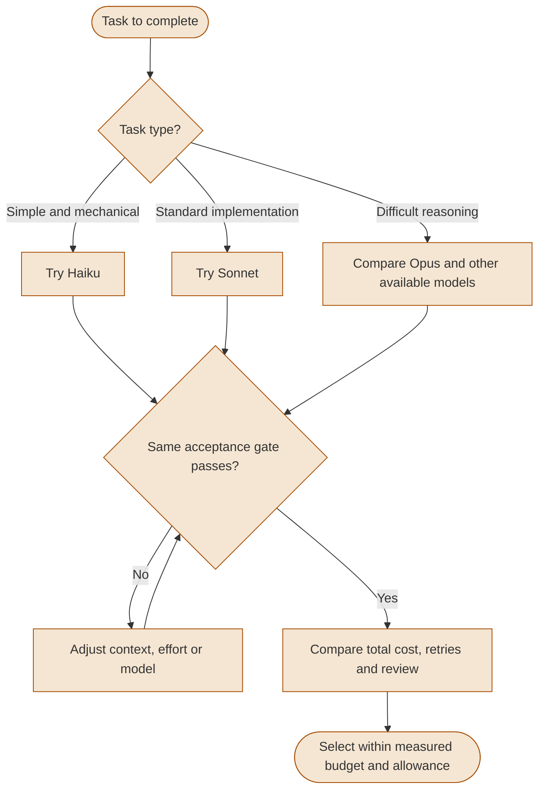
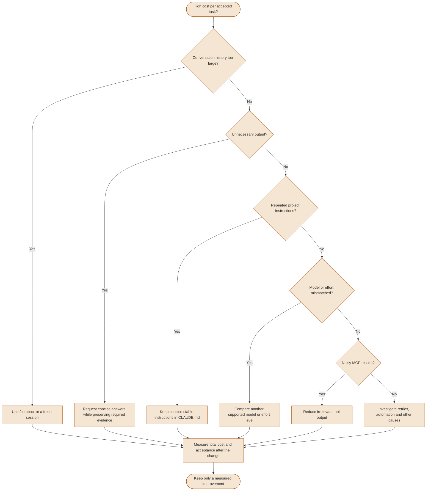
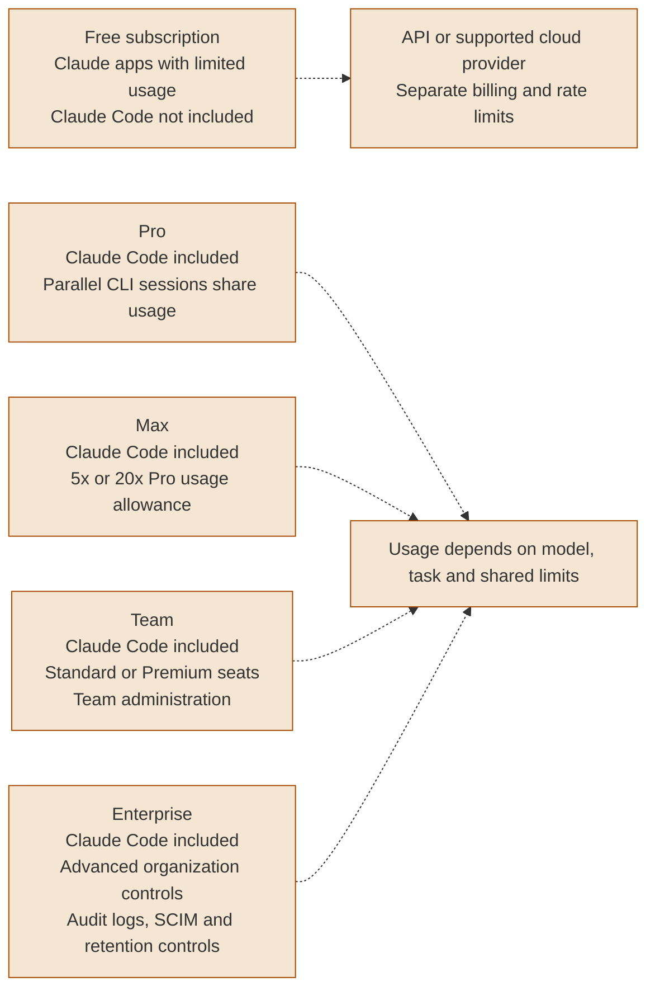

# Cost & Optimization

Control costs by measuring the cost of an accepted task, including retries, review and rework. Model availability, rates and plan allowances depend on your account and provider.

---

### Model selection decision flow

Use model families as candidates, then compare them against the same acceptance criteria. A lower token rate saves money only if quality and total task cost remain acceptable.



<details>
<summary>ASCII version</summary>

```text
Task type?
  Simple/mechanical -> try Haiku
  Standard implementation -> try Sonnet
  Difficult reasoning -> compare Opus and other available models
      |
Same acceptance gate passes?
  No -> adjust context, effort or model -> test again
  Yes -> compare total cost, retries and review
      -> select within measured budget and allowance
```

</details>

> **Source**: [Model selection](../ultimate-guide.md#25-model-selection--thinking-guide)

> **Verified 2026-10-07**: Standard direct API rates per million input/output tokens: Haiku 4.5 $1/$5; Sonnet 5.5 $2/$10; Opus 5.5 $4/$20. The 2x ratios apply to these token classes, not total task costs or subscription prices. Caching, fast mode and other modifiers change billing. [Official API pricing](https://platform.claude.com/docs/en/about-claude/pricing).

> The `sonnet` and `opus` aliases resolve differently by provider and can change. Sonnet 5 remains documented as a legacy model; this does not establish a retirement date. Check your actual model and allowance before selecting a candidate. Max has usage limits; API billing and rate limits also need a defined budget. [Model aliases](https://code.claude.com/docs/en/model-config#model-aliases), [Current plans and legacy models](https://claude.com/pricing).


---

### Cost optimization decision tree

Diagnose one recurring source of waste, change it, and replay comparable tasks. If the checks below explain none of the cost, investigate further before calling the baseline acceptable.



<details>
<summary>ASCII version</summary>

```text
High cost per accepted task?
  Large history -> /compact or fresh session
  Unnecessary output -> concise answers with required evidence
  Repeated project instructions -> concise stable CLAUDE.md
  Model/effort mismatch -> compare supported alternatives
  Noisy MCP results -> reduce irrelevant output
  None identified -> investigate retries, automation and other causes
      |
Measure total cost and acceptance -> keep a measured improvement
```

</details>

> **Source**: [Cost optimization strategies](../ultimate-guide.md#913-cost-optimization-strategies)

> **Effort**: `/effort low|medium|high|xhigh|max` offers model-dependent levels. Lower effort can reduce reasoning spend, but test the effect on completion quality. `xlow` and `default` are not current level names. [Effort levels](https://code.claude.com/docs/en/model-config#adjust-effort-level).

> Compaction and context management reduce future history input; a larger CLAUDE.md also consumes context. Establish a baseline before selecting a fix. [Official cost management](https://code.claude.com/docs/en/costs#reduce-token-usage).


---

### Subscription tiers: What each unlocks

Separate product access from usage allowance and organization controls. Parallel CLI sessions share account capacity; they are not a Max-only capability.



<details>
<summary>ASCII version</summary>

```text
Free subscription: Claude apps; Claude Code not included
Pro: Claude Code; parallel CLI sessions share plan usage
Max: Claude Code; 5x or 20x Pro usage allowance
Team: Standard/Premium seats; team administration
Enterprise: advanced controls, audit logs, SCIM, retention controls

API/cloud-provider access: separate billing and rate limits
Every paid plan remains usage-limited; parallel work uses shared capacity
```

</details>

> **Source**: [Subscription plans & limits](../ultimate-guide.md#subscription-plans--limits)

> **Verified 2026-10-07, USD**: Pro $20/month when billed monthly; annual pricing differs. Max $100 or $200/month. Team Standard $25/seat/month when billed monthly or $20 with annual billing; Premium has different pricing. Enterprise terms and usage billing must be checked for the organization. Taxes and regional pricing can differ. [Current official plans](https://claude.com/pricing).

> Multiple CLI sessions can run concurrently in separate worktrees or terminals. Their models and active tasks still consume the account's usage allowance. [Parallel sessions](https://code.claude.com/docs/en/best-practices#run-multiple-claude-sessions). A Free Claude subscription does not prevent separate paid API access. [Supported accounts](https://code.claude.com/docs/en/quickstart#before-you-begin).


---

### Token reduction strategies pipeline

Several strategies affect the same token classes. Select one lever, replay the same acceptance gate, and compare total cost, retries and review. Keep or reject that change before testing the next lever; do not multiply advertised reduction percentages.

```mermaid
flowchart LR
    A([Measure task baseline]) --> B[Select and apply ONE lever<br/>CLI-output filtering OR history compaction<br/>OR concise instructions OR a lower-rate model]
    B --> C[Replay the same acceptance gate]
    C --> D[Compare total cost, retries and review]
    D --> E{Acceptance and cost<br/>criteria satisfied?}
    E -->|Yes| F[Keep this change]
    E -->|No| G[Reject this change]
    F --> H{Another lever to test?}
    G --> H
    H -->|Yes| B
    H -->|No| I([Record the measured result])

    classDef diagramNode fill:#F5E6D3,color:#333,stroke:#A64B00
    class A,B,C,D,E,F,G,H,I diagramNode
    click A href "https://github.com/FlorianBruniaux/claude-code-ultimate-guide/blob/main/guide/ultimate-guide.md#913-cost-optimization-strategies" "View in guide"
    click B href "https://github.com/FlorianBruniaux/claude-code-ultimate-guide/blob/main/guide/ultimate-guide.md#913-cost-optimization-strategies" "View in guide"
    click C href "https://github.com/FlorianBruniaux/claude-code-ultimate-guide/blob/main/guide/ultimate-guide.md#913-cost-optimization-strategies" "View in guide"
    click D href "https://github.com/FlorianBruniaux/claude-code-ultimate-guide/blob/main/guide/ultimate-guide.md#913-cost-optimization-strategies" "View in guide"
    click E href "https://github.com/FlorianBruniaux/claude-code-ultimate-guide/blob/main/guide/ultimate-guide.md#913-cost-optimization-strategies" "View in guide"
    click F href "https://github.com/FlorianBruniaux/claude-code-ultimate-guide/blob/main/guide/ultimate-guide.md#913-cost-optimization-strategies" "View in guide"
    click G href "https://github.com/FlorianBruniaux/claude-code-ultimate-guide/blob/main/guide/ultimate-guide.md#913-cost-optimization-strategies" "View in guide"
    click H href "https://github.com/FlorianBruniaux/claude-code-ultimate-guide/blob/main/guide/ultimate-guide.md#913-cost-optimization-strategies" "View in guide"
    click I href "https://github.com/FlorianBruniaux/claude-code-ultimate-guide/blob/main/guide/ultimate-guide.md#913-cost-optimization-strategies" "View in guide"
```



<details>
<summary>ASCII version</summary>

```text
Measure baseline
  -> select and apply ONE lever:
       CLI-output filtering OR history compaction
       OR concise instructions OR a lower-rate model
  -> replay the same acceptance gate
  -> compare total cost, retries and review
  -> acceptance and cost criteria satisfied?
       Yes: keep this change / No: reject this change
  -> another lever? Yes: select the next one / No: record result
```

</details>

> **Source**: [Cost optimization strategies](../ultimate-guide.md#913-cost-optimization-strategies)

> RTK is a third-party CLI-output filtering example, not an Anthropic capability or a guaranteed token reduction. Inspect the retained output for missing diagnostic information. No RTK gain is asserted here.

> `/usage` shows session cost estimates and plan usage; `/cost` is a valid alias. Estimated session dollar costs are not the invoice and do not represent additional charges for included subscription usage. [Usage command](https://code.claude.com/docs/en/commands), [Cost estimates](https://code.claude.com/docs/en/costs#using-the-/usage-command).
