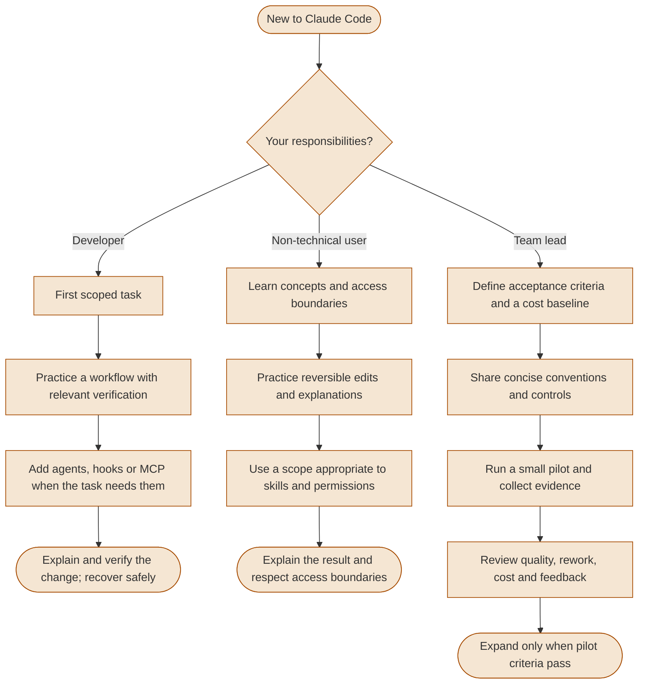
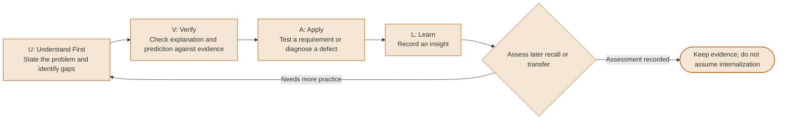
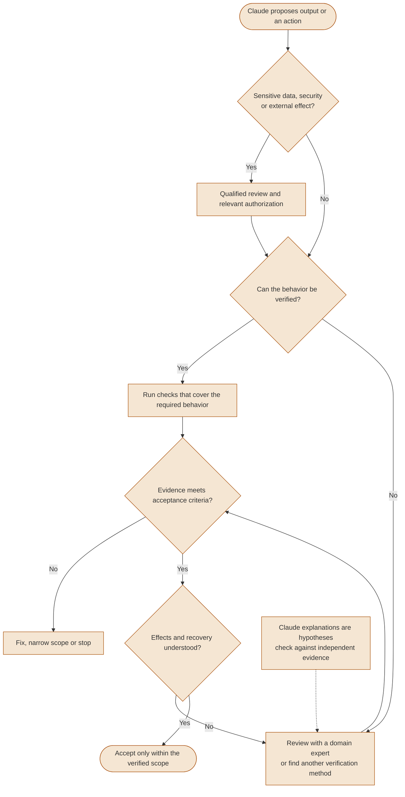

# Adoption & Learning

Adopt Claude Code through scoped tasks, relevant verification and explicit checks of human understanding. Learning and productivity gains require evidence from the people and tasks involved.

---

### Onboarding adaptive learning paths

Choose a starting path based on responsibilities and existing skills. Progress when the observable criteria pass; no fixed training or team-adoption duration is implied.



<details>
<summary>ASCII version</summary>

```text
Developer:
  Scoped task -> verified workflow -> add needed capabilities
  Gate: explain/verify the change and recover safely

Non-technical user:
  Concepts/access boundaries -> reversible practice -> suitable scope
  Gate: explain the result and respect access boundaries

Team lead:
  Acceptance/cost baseline -> shared conventions -> small pilot
  Gate: review quality, rework, cost and feedback before expansion
```

</details>

> **Source**: [Adoption approaches](../roles/adoption-approaches.md#start--build--scale-a-practical-navigation-layer)

> These are proposed paths, not measured completion times. The official quickstart covers installation, supported accounts and first tasks; the organization must evaluate its own pilot outcomes. [Official quickstart](https://code.claude.com/docs/en/quickstart).


---

### UVAL learning protocol

UVAL is a proposed practice for checking comprehension during AI-assisted work. It does not establish a retention benefit or replace the policy for accepting a change.



<details>
<summary>ASCII version</summary>

```text
UNDERSTAND -> VERIFY -> APPLY -> LEARN
U: State the problem and identify knowledge gaps
V: Check explanation and prediction against evidence
A: Test a requirement or diagnose a defect; adapt when needed
L: Record an insight

Assess later recall/transfer -> practice further or record the result
Retention benefit remains to be evaluated
```

</details>

> **Source**: [The UVAL protocol](../roles/learning-with-ai.md#the-uval-protocol)


---

### Trust calibration matrix

Assess data sensitivity, security and external effects before accepting an output. Tests and rollback establish only their verified scope; a Git revert cannot reverse data disclosure or every external action.



<details>
<summary>ASCII version</summary>

```text
Sensitive data/security/external effect?
  Yes -> qualified review and relevant authorization
  No -> continue to verification
      |
Can behavior be verified?
  Yes -> run relevant checks
  No -> domain review or another verification method
      |
Evidence meets acceptance criteria?
  No -> fix, narrow scope or stop
  Yes -> understand effects and recovery
      -> accept only within the verified scope

An explanation is a hypothesis; Git rollback does not undo disclosure
```

</details>

> **Source**: [Trust calibration](../ultimate-guide.md#17-trust-calibration-when-and-how-much-to-verify)

> The reviewer remains responsible for the safety of proposed code and commands. Review requirements depend on the action and its effects. [Anthropic security guidance](https://code.claude.com/docs/en/security#user-responsibility).
