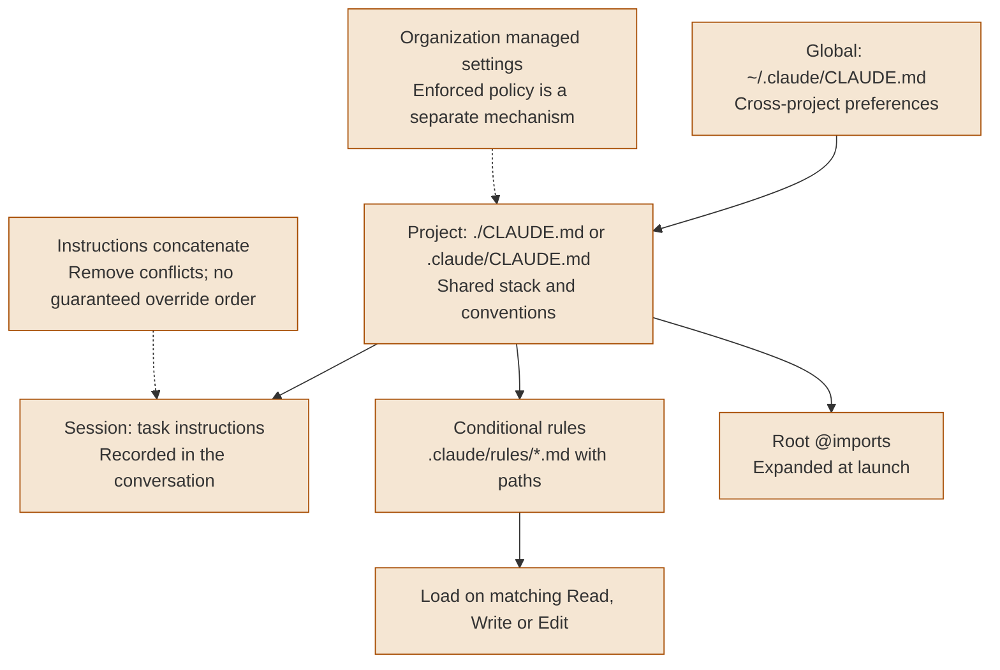
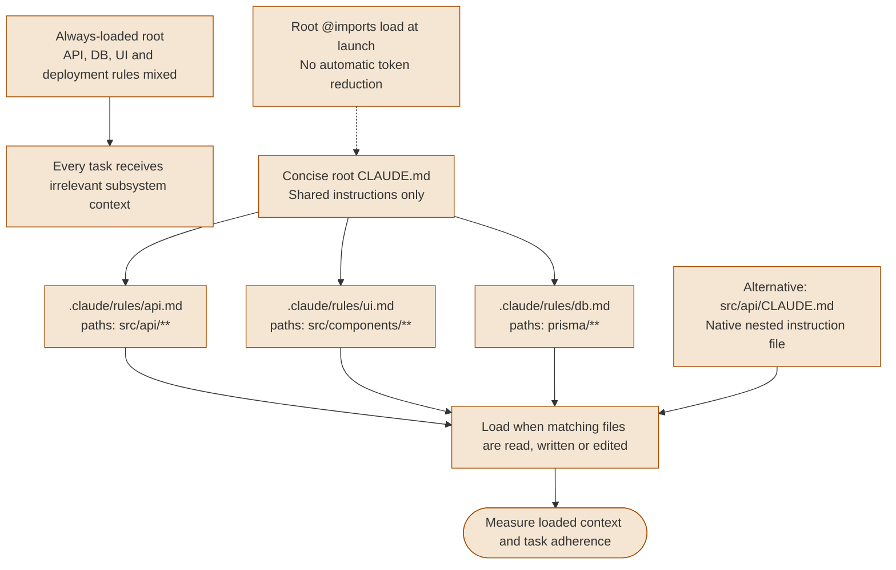
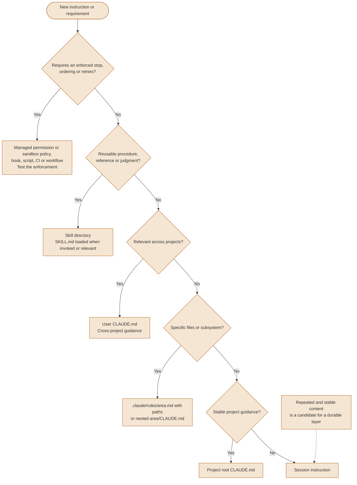

# Context Engineering

Load relevant instructions and evidence, then measure whether Claude follows the required constraints on real tasks. Shorter context alone does not prove better results.

---

### The 3-layer context system

This teaching view separates global, project and session instructions. It is not a complete inventory of organization policy, auto memory or runtime tool context. Instruction files become model context, not enforced security settings.



<details>
<summary>ASCII version</summary>

```text
GLOBAL: ~/.claude/CLAUDE.md -> cross-project preferences
PROJECT: ./CLAUDE.md or .claude/CLAUDE.md -> shared stack and conventions
SESSION: task instructions -> recorded in the conversation

Root @imports -> expanded at launch
.claude/rules/*.md + paths -> conditional Read/Write/Edit loading
Instructions concatenate; keep them consistent
Organization managed settings -> separate enforced policy mechanism
Session instructions do not become durable project/global policy
```

</details>

> **Source**: [Configuration hierarchy](../core/context-engineering.md#3-configuration-hierarchy)

> Native loading distinguishes imports from conditional rules. Conflicting instruction text has no guaranteed override order. [Instruction loading](https://code.claude.com/docs/en/memory#how-claude-md-files-load), [Imports](https://code.claude.com/docs/en/memory#import-additional-files), [Conditional rules](https://code.claude.com/docs/en/memory#path-specific-rules).

> `/add-dir` extends working-directory access for the session; it is not an instruction-import command. [Command reference](https://code.claude.com/docs/en/commands).


---

### Context budget & adherence checks

There is no universal adherence percentage for a given line count. Review relevance and conflicts, measure the context actually loaded, then compare violations and task outcomes before and after a change.

```mermaid
flowchart LR
    A[Inventory loaded instructions] --> B[Find irrelevant or conflicting rules]
    B --> C[Keep shared instructions concise]
    C --> D[Scope subsystem rules to matching files]
    D --> E[Replay representative acceptance checks]
    E --> F[Compare loaded context, violations and rework]
    F --> G([Keep the change only when the evidence supports it])

    classDef diagramNode fill:#F5E6D3,color:#333,stroke:#A64B00
    class A,B,C,D,E,F,G diagramNode
    click A href "https://github.com/FlorianBruniaux/claude-code-ultimate-guide/blob/main/guide/core/context-engineering.md#2-the-context-budget" "View in guide"
    click B href "https://github.com/FlorianBruniaux/claude-code-ultimate-guide/blob/main/guide/core/context-engineering.md#2-the-context-budget" "View in guide"
    click C href "https://github.com/FlorianBruniaux/claude-code-ultimate-guide/blob/main/guide/core/context-engineering.md#2-the-context-budget" "View in guide"
    click D href "https://github.com/FlorianBruniaux/claude-code-ultimate-guide/blob/main/guide/core/context-engineering.md#2-the-context-budget" "View in guide"
    click E href "https://github.com/FlorianBruniaux/claude-code-ultimate-guide/blob/main/guide/core/context-engineering.md#2-the-context-budget" "View in guide"
    click F href "https://github.com/FlorianBruniaux/claude-code-ultimate-guide/blob/main/guide/core/context-engineering.md#2-the-context-budget" "View in guide"
    click G href "https://github.com/FlorianBruniaux/claude-code-ultimate-guide/blob/main/guide/core/context-engineering.md#2-the-context-budget" "View in guide"
```



<details>
<summary>ASCII version</summary>

```text
Inventory loaded instructions
  -> review irrelevant/conflicting rules
  -> concise shared instructions
  -> scope subsystem rules
  -> replay representative acceptance checks
  -> compare context size, violations and rework
  -> keep changes supported by evidence

No fixed adherence curve or universal context-reduction gain is asserted
```

</details>

> **Source**: [The context budget](../core/context-engineering.md#2-the-context-budget)

> Anthropic recommends short, organized and consistent CLAUDE.md files, with a target under 200 lines per file. This is guidance, not a guaranteed adherence rate. Imports help organization but still load context. [Writing effective instructions](https://code.claude.com/docs/en/memory#write-effective-instructions).


---

### Monolithic vs. modular architecture

Move subsystem-specific instructions out of an always-loaded root into native conditional rules or nested CLAUDE.md files. Splitting root imports into more files changes organization but does not itself reduce startup context.



<details>
<summary>ASCII version</summary>

```text
Always-loaded monolith -> irrelevant subsystem rules on every task

Concise root CLAUDE.md: shared instructions
  .claude/rules/api.md [paths: src/api/**]
  .claude/rules/ui.md  [paths: src/components/**]
  .claude/rules/db.md  [paths: prisma/**]
    -> load on matching Read/Write/Edit
Alternative: src/api/CLAUDE.md -> loads when that subtree is accessed

Root @imports expand at launch
Measure context and adherence; no fixed percentage gain is promised
```

</details>

> **Source**: [Modular architecture](../core/context-engineering.md#4-modular-architecture)

> Arbitrary names such as `CLAUDE-api.md` are not automatically discovered as nested instruction files. Use the native names or a conditional rules file. [Native project-memory loading and rules](https://code.claude.com/docs/en/memory).


---

### Rule placement decision tree

Decide whether a requirement needs enforcement before choosing the scope of its instructional text. A skill provides reusable guidance; a permission rule, hook, script or CI gate must implement and verify any required hard stop.



<details>
<summary>ASCII version</summary>

```text
Needs an enforced stop/order/retries?
  Yes -> managed permissions/sandbox, hook/script/CI/workflow; test it
  No -> reusable procedure/reference/judgment?
    Yes -> skill
    No -> cross-project? -> user CLAUDE.md
      Otherwise -> subsystem? -> rules file with paths or nested CLAUDE.md
        Otherwise -> stable project guidance? -> root CLAUDE.md
          Otherwise -> session instruction

Repeated AND stable content is a candidate for a durable layer
```

</details>

> **Source**: [Configuration hierarchy](../core/context-engineering.md#3-configuration-hierarchy)

> Instruction text shapes model behavior; it does not replace enforcement. Hook decisions and permissions have their own behavior and scope. [Hooks](https://code.claude.com/docs/en/hooks), [Permissions and sandboxing](https://code.claude.com/docs/en/permissions#how-permissions-interact-with-sandboxing).
