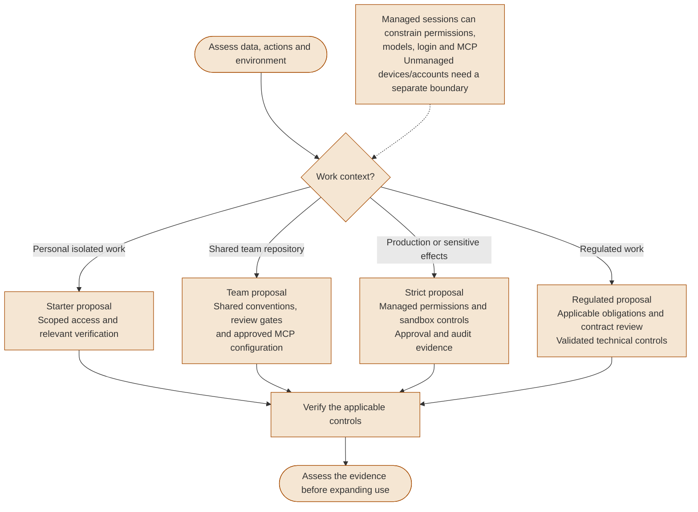
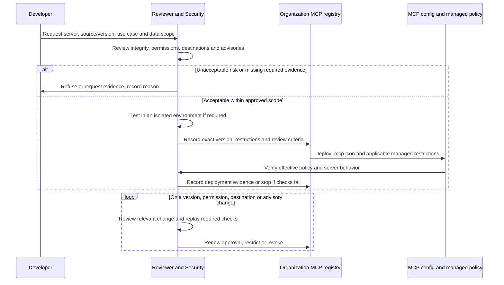
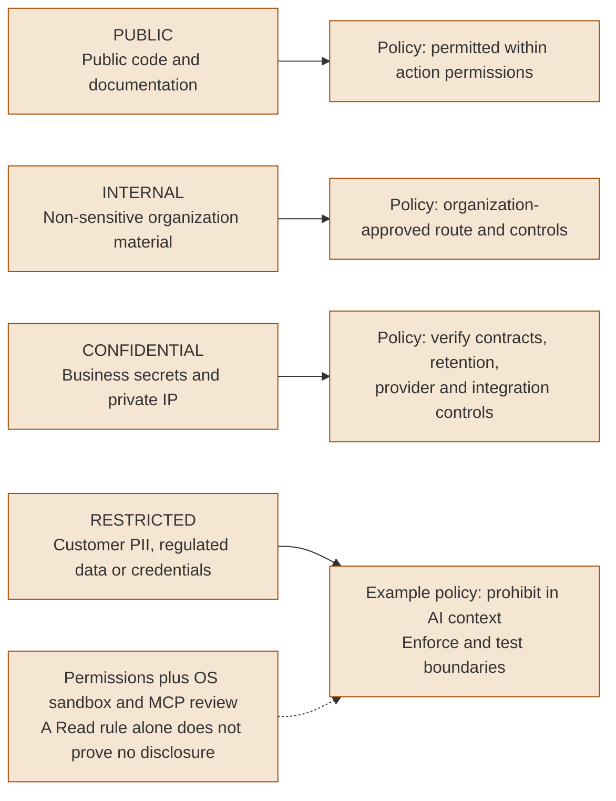

# Enterprise Governance

These diagrams propose organization policies for Claude Code. Adapt them to actual data, actions, deployed controls and contractual obligations. They do not establish compliance or certification.

---

### Governance risk tiers: What to control and when

Choose controls by the effects and sensitivity of the work, then verify that the policy reaches the relevant session. The four tiers are proposed organization patterns, not Anthropic product tiers or regulatory certifications.



<details>
<summary>ASCII version</summary>

```text
Personal isolated work -> scoped access + relevant verification
Shared team repository -> shared conventions + review/MCP controls
Production/sensitive effects -> managed permissions + sandbox + approvals
Regulated work -> obligations/contracts + validated controls
    -> verify actual deployment and effects before expanding use

Managed sessions can constrain permissions, models, login and MCP
Unmanaged devices/accounts are outside that deployment's boundary
These are proposed policies; no setup duration or compliance is guaranteed
```

</details>

> **Source**: [Governance split](../security/enterprise-governance.md#1-local-vs-shared-the-governance-split)

> Organization policies can constrain sessions through managed settings, model allowlists and login restrictions. Applicability varies by deployment and surface; a repository convention alone does not prove enforcement. [Managed settings](https://code.claude.com/docs/en/managed-settings), [Settings precedence](https://code.claude.com/docs/en/settings#settings-precedence).


---

### MCP governance workflow

Treat the registry as organization bookkeeping and the deployed MCP configuration as a separate control. Review source integrity, permissions, data destinations and advisories; popularity or a patch version does not prove a server safe.



<details>
<summary>ASCII version</summary>

```text
Request: source/version, use case, data scope
  -> review integrity, permissions, destinations, advisories
  -> unacceptable risk or missing evidence? Refuse/request evidence
  -> acceptable scope? Test in isolation when required
  -> registry: version, restrictions, review criteria
  -> deploy .mcp.json + applicable managed restrictions
  -> verify effective policy and server behavior; stop on failed checks

Change/advisory -> review relevant delta -> verify -> renew/restrict/revoke
No automatic approval merely because the version increment is a patch
```

</details>

> **Source**: [MCP governance workflow](../security/enterprise-governance.md#3-mcp-governance-workflow)

> Project servers are defined in `.mcp.json`. Organization-enforced restrictions require managed MCP configuration or managed settings; committing a shared configuration does not itself prohibit local overrides. An organization registry is not a native Claude Code configuration format. [Project MCP scope](https://code.claude.com/docs/en/mcp#project-scope), [Managed MCP configuration](https://code.claude.com/docs/en/mcp#managed-mcp-configuration).

> Review cadence, expiry and trial requirements are organization decisions. Set them from the actual risk and change triggers; no fixed review duration or universal approval interval is implied.


---

### Data classification & Claude Code access rules

This is an example organization classification policy. Approve the processing route and test access controls for the actual data and integrations. Public content still requires action permissions and can contain malicious instructions.



<details>
<summary>ASCII version</summary>

```text
Example organization policy:
  PUBLIC -> permitted within action permissions
  INTERNAL -> approved processing route and controls
  CONFIDENTIAL -> verify contracts, retention, provider and integrations
  RESTRICTED -> prohibited in AI context under this example policy
      -> enforce and test file, shell, network and MCP boundaries

Separate deny examples: Read(./.env), Read(./secrets/**)
Read rules alone do not prove that restricted data cannot enter context
```

</details>

> **Source**: [AI usage charter](../security/enterprise-governance.md#2-ai-usage-charter)

> ZDR for Claude Code on Enterprise requires specific eligibility and enablement; it does not cover third-party tools or MCP services. Commercial training defaults, retention and organization processing approval are separate questions. [ZDR scope](https://code.claude.com/docs/en/zero-data-retention#what-zdr-does-not-cover), [Data policies](https://code.claude.com/docs/en/data-usage#data-policies).

> Permissions and sandboxing are complementary controls. Use separate rules for separate file patterns, review shell and integration access, and test both permitted and blocked scenarios. Neither an instruction nor a single `Read` rule proves complete data confinement. [Permission syntax](https://code.claude.com/docs/en/permissions#permission-rule-syntax), [Permissions and sandboxing](https://code.claude.com/docs/en/permissions#how-permissions-interact-with-sandboxing).
