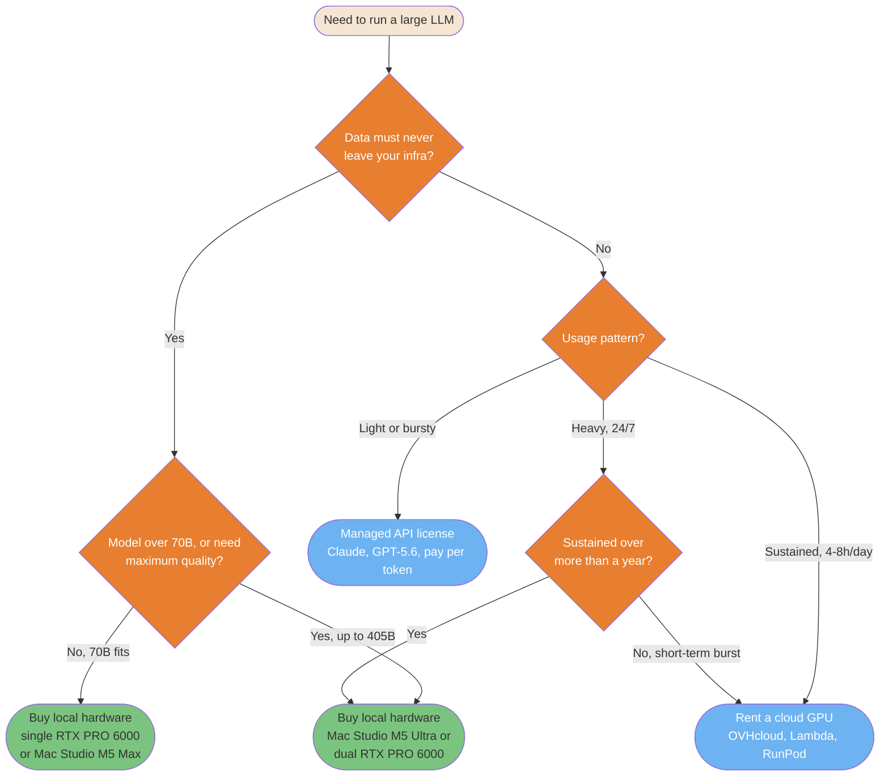

# Local vs Cloud: LLM Hardware and Inference Economics

> **Reading time**: ~20 minutes
>
> **Purpose**: Answer one question with numbers instead of vibes: for running a large open-weight model (70B to 400B+ parameters), when does a local hardware purchase beat renting a cloud GPU or paying per token, and what actually fits on what machine.

---

## Table of Contents

- [Data Snapshot Date](#data-snapshot-date)
- [Sizing Local Hardware with llmfit](#sizing-local-hardware-with-llmfit)
- [Ten Comparable Hardware Configurations](#ten-comparable-hardware-configurations)
- [What Actually Fits: Named Models](#what-actually-fits-named-models)
- [Cloud GPU Rental Pricing](#cloud-gpu-rental-pricing)
- [One-Year Cost Projections](#one-year-cost-projections)
- [Cloud API Throughput: Claude vs GPT-5.6](#cloud-api-throughput-claude-vs-gpt-56)
- [Why Cloud and Local Tokens/Sec Are Not Comparable](#why-cloud-and-local-tokenssec-are-not-comparable)
- [Decision Diagram](#decision-diagram)
- [Decision Framework](#decision-framework)

---

## Data Snapshot Date

Every price, spec, and throughput number on this page is a snapshot from **August 2026**. GPU prices move by double digits in weeks, cloud providers reprice without notice, and model families get replaced. Treat the tables as a method to reproduce, not a permanent price list. The queries and CLI commands used to produce this page are included so you can rerun them.

---

## Sizing Local Hardware with llmfit

Before buying anything, check what a given memory budget can actually run. [`llmfit`](https://github.com/AlexsJones/llmfit) (MIT, `brew install llmfit`) detects your hardware and scores its model database for fit, speed, and quality.

```bash
llmfit system                                    # detect current hardware
llmfit --memory 96G --ram 128G fit --json         # simulate a different memory budget
llmfit --memory 96G --ram 128G info "meta-llama/Llama-3.3-70B-Instruct"
```

Two limits to know before trusting its output:

**`--memory` overrides GPU VRAM, `--ram` overrides system RAM. They are not interchangeable.** On a discrete Nvidia GPU, only VRAM holds model weights during normal inference; system RAM is not usable for that purpose except through CPU offload, which drops throughput below 5 tokens/sec. On Apple Silicon and AMD's Ryzen AI unified-memory chips, the two numbers should be set equal, because there is only one physical memory pool.

**The tool cannot switch inference backend.** It detects the backend of the machine it runs on (Metal, CUDA, ROCm) and keeps using that backend's speed model even when you override memory size to simulate different hardware. Run it on an Nvidia machine for Nvidia numbers, an Apple Silicon machine for Apple numbers. Simulating an RTX PRO 6000 from a MacBook gives you a correct memory-capacity answer (what fits) and a wrong throughput answer (tokens/sec), because the tool is still computing speed from the Mac's Metal roofline model, not from CUDA.

---

## Ten Comparable Hardware Configurations

Bare GPUs are not comparable to laptops or appliances. The table below only lists complete systems: CPU, memory, GPU, and storage together, sorted by increasing price. For workstation builds around a bare Nvidia GPU (no fixed CPU from the vendor), the CPU column shows one realistic example, not a spec.

| # | Configuration | CPU | System memory | GPU | Storage | Price (Aug 2026) |
|---|---|---|---|---|---|---|
| 1 | AMD Ryzen AI Halo | Ryzen AI Max+ 395, Zen 5, 16 cores/32 threads | 128 GB unified LPDDR5x | Radeon 8060S integrated, 40 CU RDNA 3.5, no dedicated VRAM | 2 TB SSD | ~$3,999 (~€3,700-4,000) |
| 2 | NVIDIA DGX Spark | Grace, 20 Arm cores (10x Cortex-X925 + 10x Cortex-A725) | 128 GB unified LPDDR5x | GB10 Blackwell, 6,144 CUDA cores (48 SM), no dedicated VRAM | 4 TB NVMe (included) | ~$4,699 (~€4,180-4,700) |
| 3 | MacBook Pro, Apple M5 Pro | Apple M5 Pro, 15 or 18 cores | 48 GB unified | Integrated GPU, 20 cores | 2 TB SSD | ~€4,500-5,000 |
| 4 | Workstation, 1x RTX 5090 | *Example*: AMD Ryzen 9 9950X, 16 cores | 64-128 GB DDR5 (host only) | RTX 5090, 21,760 CUDA cores, 32 GB GDDR7 dedicated | 2-4 TB NVMe | ~€5,000-6,000 |
| 5 | MacBook Pro, Apple M5 Max | Apple M5 Max, 18 cores | 128 GB unified | Integrated GPU, 40 cores | 2 TB SSD | ~€5,500-6,500 |
| 6 | AMD Ryzen AI Max PRO 400 ("Gorgon Halo") | Ryzen AI Max+ PRO 495, Zen 5, 16 cores/32 threads, up to 5.2 GHz | 192 GB unified + 160 GB dedicated graphics memory | Radeon 8065S integrated, 40 CU RDNA 3.5 | 2-4 TB (estimated) | Unannounced, ~€5,000-10,000 est. (Q3 2026 launch, no independent benchmark exists) |
| 7 | Workstation, dual RTX 5090 | *Example*: AMD Threadripper 7960X, 24 cores | 128-256 GB DDR5 (host only) | 2x RTX 5090, 43,520 CUDA cores combined, 64 GB GDDR7 combined, no NVLink | 4 TB NVMe | ~€8,000-12,000 |
| 8 | Mac Studio, Apple M5 Ultra | Apple M5 Ultra, 36 cores | 256 GB unified | Integrated GPU, 80 cores | 4 TB SSD | ~€12,000 |
| 9 | Workstation, RTX PRO 6000 Blackwell | *Example*: AMD Threadripper PRO 7975WX, 32 cores | 128-256 GB DDR5 ECC (host only) | RTX PRO 6000, 24,064 CUDA cores, 96 GB GDDR7 ECC dedicated | 4 TB NVMe | ~€16,000-18,000 (the card alone is ~€14,000) |
| 10 | Workstation, dual RTX PRO 6000 Blackwell | *Example*: AMD Threadripper PRO 7995WX, 96 cores | 256 GB+ DDR5 ECC (host only) | 2x RTX PRO 6000, 48,128 CUDA cores combined, 192 GB GDDR7 combined, no NVLink | 4-8 TB NVMe | ~€30,000-32,000+ |

Sources: Nvidia RTX 5090 and RTX PRO 6000 Blackwell core counts and VRAM confirmed via [Central Computer](https://www.centralcomputer.com/pny-nvidia-rtx-pro-6000-graphics-card-96gb-gddr6-24-064-cuda-cores-pci-express-5-0-x16-600w-vcnrtxpro6000b-pb.html) and [Schneider Digital](https://shop.schneider-digital.com/en/graphics-cards/nvidia/rtx-pro-blackwell-series/nvidia-rtx-pro-6000-blackwell-workstation-edition-96gb-pcie-5.0-x16) (card price ~€14,000). GB10 specs from [Arm Learning Paths](https://learn.arm.com/learning-paths/laptops-and-desktops/dgx_spark_llamacpp/1_gb10_introduction/) and [NVIDIA DGX Spark](https://www.nvidia.com/en-us/products/workstations/dgx-spark/). Radeon 8060S CU count from [TechPowerUp](https://www.techpowerup.com/342635/amd-readies-ryzen-ai-max-388-8c-16t-and-full-40-cu-radeon-8060s-gpu). Apple M5 Pro/Max chip specs (core counts, memory bandwidth, confirmed 24/48/64 GB tiers) from [Apple's own tech specs page](https://support.apple.com/en-mide/126318). Apple has not published M5 Ultra specs; the 256 GB / 36-core / 80-core figures come from pre-launch reporting, not an Apple source.

---

## What Actually Fits: Named Models

Sorting `llmfit`'s database by raw parameter count surfaces obscure or roleplay-oriented fine-tunes that happen to fit in memory, not the flagship models most people actually want to run. Querying `llmfit info` for specific well-known repos gives a cleaner answer, and the memory-required figure is backend-independent (pure arithmetic on model size and quantization), so it holds regardless of which machine the query runs on.

| Hardware memory budget | Model that fits comfortably | Quantization | Min. VRAM/RAM required |
|---|---|---|---|
| 32 GB VRAM (1x RTX 5090) | **Qwen2.5-32B-Instruct** | 4-bit | 16.8 GB, comfortable fit |
| 32 GB VRAM (1x RTX 5090) | Llama 3.3 70B Instruct | Q2 (aggressive) | 36.1 GB, exceeds available VRAM, marginal at best |
| 48 GB unified (MacBook Pro M5 Pro) | **Qwen2.5-72B-Instruct** | 4-bit | 37.2 GB, tight marginal fit |
| 64 GB VRAM (dual RTX 5090) | **Llama 3.3 70B Instruct** or **Qwen2.5-72B-Instruct** | 4-bit | ~36-37 GB, comfortable, sharded across cards |
| 96 GB VRAM (RTX PRO 6000) | **Llama 3.3 70B Instruct** | 8-bit / FP8 | 36.1 GB, comfortable, large headroom for KV cache |
| 96 GB VRAM (RTX PRO 6000) | **Mixtral 8x22B Instruct** (140.6B total) | 4-bit | 72 GB, comfortable |
| 128 GB unified (MacBook Pro M5 Max, DGX Spark, Ryzen AI Halo) | **Llama 3.3 70B Instruct** | 8-bit | 36.1 GB, comfortable |
| 192-256 GB VRAM/unified (dual RTX PRO 6000, Mac Studio M5 Ultra) | **Llama 3.1 405B Instruct** | 4-bit | 207.9 GB, marginal, needs the full budget |
| Any config tested, up to 256 GB | **DeepSeek-V3** (684.5B total) | 4-bit | 350.6 GB, does not fit anywhere on this page |

DeepSeek-V3/R1-class models do not fit on any configuration in the €30,000 range covered here. Reaching them requires either heavier quantization than `llmfit` rates as usable, or a budget well past this page's scope.

---

## Cloud GPU Rental Pricing

Hourly, on-demand, per GPU. USD figures kept as published; EUR given only where the provider quotes EUR directly.

| Provider | GPU | Price/hour |
|---|---|---|
| OVHcloud | H100 80 GB | €2.80 ($2.99) |
| OVHcloud | A100 80 GB | $3.07 |
| OVHcloud | L40S 48 GB | $1.80 |
| RunPod (Secure Cloud) | L40S 48 GB | $0.99 |
| RunPod (Community Cloud) | L40S 48 GB | $0.79 |
| Lambda | H100 80 GB SXM | $3.99-4.29 depending on node size |
| Lambda | A6000 48 GB (RTX PRO 6000-class) | $1.09 |
| Decentralized (Vast.ai-class marketplace) | H100 80 GB | $2.50-3.89 |
| AWS | H100 80 GB (no direct AWS tariff found; market range per [AltStreet](https://altstreet.investments/tools/gpu/gpu-price-comparison)) | $8.00-12.29, mid estimate $10 |
| AWS | H200, `p5en.48xlarge`, on-demand (8-GPU node, per GPU) | $7.91 |
| AWS | H200, `p5en.48xlarge`, spot (per GPU) | $3.37 |

AWS does not sell a single-GPU H200 instance: the smallest P5en node is already 8 GPUs at $63.30/hour total. For a "one GPU as a remote workstation" use case, OVHcloud, Lambda, or RunPod fit the shape of the need better than AWS. Sources: [OVHcloud price list](https://us.ovhcloud.com/public-cloud/prices/), [Cloud Mercato H100-380](https://pcr.cloud-mercato.com/providers/ovh/flavors/H100-380), [Lambda pricing](https://lambda.ai/pricing), [RunPod L40S](https://www.runpod.io/gpu-models/l40s), [Vantage EC2 P5en](https://instances.vantage.sh/aws/ec2/p5en.48xlarge).

---

## One-Year Cost Projections

`annual cost = price/hour × hours/day × 365`. Three usage patterns, same GPU class (H100/H200), across providers.

| Provider / GPU | 4h/day | 8h/day | 24/7 |
|---|---|---|---|
| OVH H100 80 GB | ~€4,088 | ~€8,176 | ~€24,528 |
| Decentralized H100 (~$3/h) | ~$4,380 | ~$8,760 | ~$26,280 |
| Lambda H100 80 GB | ~$6,263 (~€5,825) | ~$12,527 (~€11,650) | ~$37,580 (~€34,955) |
| AWS H200 spot | ~$4,925 (~€4,580) | ~$9,850 (~€9,161) | ~$29,547 (~€27,479) |
| AWS H200 on-demand | ~$11,552 (~€10,743) | ~$23,104 (~€21,487) | ~$69,309 (~€64,457) |
| AWS H100 (~$10/h estimate) | ~$14,600 (~€13,578) | ~$29,200 (~€27,156) | ~$87,600 (~€81,468) |

Cross-referenced against the hardware table above:

**At light usage (4h/day), OVH's rental cost for one year (~€4,088) roughly equals the purchase price of the cheapest machines on this page** (Ryzen AI Halo, DGX Spark, ~€3,700-4,700). Buying wins from year two onward at this usage level, on the cheapest provider.

**At heavy usage (24/7), OVH's rental cost for one year (~€24,528) already exceeds a Mac Studio M5 Ultra 256 GB (~€12,000) and approaches an RTX PRO 6000 workstation (~€16,000-18,000).** At this usage level, buying wins inside year one, even against the cheapest cloud provider tested.

**AWS is not economically viable for this use case at any usage level.** Even at 4h/day, AWS H100 (~€13,578/year) costs nearly as much as an entire RTX PRO 6000 workstation bought once. At 24/7, AWS H100 (~€81,468/year) funds close to three dual-RTX-PRO-6000 workstations (~€30,000 each) in a single year of rental.

---

## Cloud API Throughput: Claude vs GPT-5.6

OpenAI's GPT-5.6 family (launched July 9, 2026) ships in three durable capability tiers named after celestial bodies: **Sol** (flagship), **Terra** (balanced mid-tier), **Luna** (fast, cheap). All three are available in ChatGPT, Codex, and the API, and generally available on Amazon Bedrock. Anthropic's current lineup for comparison: **Claude Opus 5** (flagship) and **Claude Sonnet 5** (mid-tier), both defaults in Claude Code.

| Model | Typical throughput | Max-effort/benchmark throughput | Time to first token | Price ($/M tokens, in/out) |
|---|---|---|---|---|
| GPT-5.6 Sol | ~70 tok/s (OpenRouter P50) | 74.3 tok/s (ArtificialAnalysis) | ~138.6s in max reasoning mode | $5 / $30 |
| GPT-5.6 Terra | ~58 tok/s (OpenRouter P50) | n/a | ~2.48s | $2 / $12 (cut 20% from launch, effective July 30, 2026) |
| GPT-5.6 Luna | ~112 tok/s (OpenRouter P50) | 140.7 tok/s (ArtificialAnalysis) | ~150.7s in max reasoning mode | $0.20 / $1.20 (cut 80% from launch, effective July 30, 2026) |
| Claude Sonnet 5 | ~75.9 tok/s (ArtificialAnalysis, max effort) | n/a | not published | $2 / $10 |
| Claude Opus 5 | **~26 tok/s average** (LLM-Benchmarks production telemetry, min 5.3, max 60.9) | n/a | ~2.87s | $5 / $25 (fast mode research preview: $10 / $50) |

Claude Opus 5's ~26 tok/s average comes from production telemetry across real calls, not a single benchmark preset, a materially lower number than the ~55-80 tok/s figures reported for Opus 5 under lighter-effort presets on other trackers. Anthropic optimizes Opus 5 for reasoning depth, not raw streaming speed.

On specialized hardware (Cerebras wafer-scale systems, not a standard cloud GPU), Sol reaches roughly **750 tok/s**, about 10x the typical cloud API rate. This confirms the throughput ceiling is set by deployment infrastructure and multi-tenant scheduling, not by the model's architecture alone.

Sources: [OpenRouter Sol](https://openrouter.ai/openai/gpt-5.6-sol), [OpenRouter Terra](https://openrouter.ai/openai/gpt-5.6-terra), [OpenRouter Luna](https://openrouter.ai/openai/gpt-5.6-luna), [ArtificialAnalysis Sol](https://artificialanalysis.ai/models/gpt-5-6-sol), [ArtificialAnalysis Luna](https://artificialanalysis.ai/models/gpt-5-6-luna), [ArtificialAnalysis Sonnet 5](https://artificialanalysis.ai/models/claude-sonnet-5), [LLM-Benchmarks Anthropic](https://llm-benchmarks.com/providers/anthropic), [OpenAI price-performance update](https://openai.com/index/advancing-the-price-performance-frontier-with-gpt-5-6/), [Cerebras](https://www.cerebras.ai/blog/getting-the-most-out-of-gpt-5-6-sol-terra-and-luna).

---

## Why Cloud and Local Tokens/Sec Are Not Comparable

Comparing a cloud API's tokens/sec to a local GPU's tokens/sec is comparing a car's speed on a congested highway to the same car's speed on an empty road. Three concrete mechanisms cause the gap:

**Cloud time-to-first-token often hides invisible reasoning.** Sol and Luna's 138-150 second TTFT figures under max-reasoning presets come from internal reasoning tokens that are computed and counted but never streamed to the client. A locally run quantized model has no such phase; TTFT drops to tens of milliseconds once weights are loaded.

**Cloud infrastructure optimizes aggregate throughput across every concurrent user, not your single request.** Dynamic batching, shared queues, and paid priority tiers (Opus 5's fast mode at 2x price is exactly this, sold openly) all trade individual latency for total system utilization. A local GPU serves only you; there is no queue.

**Cloud frontier models and local models are not the same size or precision.** Sol and Opus 5 run at full precision on hundreds of billions of parameters. A local deployment typically runs 4-8 bit quantized weights on 7-70B parameters. Illustrative local ranges from the same evidence base: a 7B model on an RTX-4090-class GPU reaches roughly 100-150 tok/s, a 13B model 50-100 tok/s, a 30B model 20-50 tok/s, a 70B model on a single GPU 10-30 tok/s. These numbers land in the same range as Terra and Luna's cloud figures by coincidence of scale, not because the comparison is meaningful.

One measured data point from this page's own research process: `llmfit system` on a real MacBook Pro M5 Max reported **171 GB/s measured RAM bandwidth**, well below the ~460-614 GB/s Apple lists as the chip's theoretical peak. Real, measured, sustained bandwidth on your actual machine is the number that predicts your actual tokens/sec, not a spec sheet peak.

---

## Decision Diagram



<details>
<summary>ASCII version</summary>

```
Need to run a large LLM
└─ Data must never leave your infra?
   ├─ Yes → Model over 70B, or need maximum quality?
   │        ├─ Yes, up to 405B → BUY: Mac Studio M5 Ultra or dual RTX PRO 6000
   │        └─ No, 70B fits    → BUY: single RTX PRO 6000 or Mac Studio M5 Max
   └─ No  → Usage pattern?
            ├─ Light or bursty      → LICENSE: managed API (Claude, GPT-5.6)
            ├─ Sustained, 4-8h/day  → RENT: cloud GPU (OVHcloud, Lambda, RunPod)
            └─ Heavy, 24/7          → Sustained over more than a year?
                                       ├─ Yes           → BUY (see above)
                                       └─ No, short-term → RENT (see above)
```

</details>

## Decision Framework

**Light or bursty usage, no data sovereignty requirement**: use a managed API (Claude, GPT-5.6) or a specialized inference provider. No hardware to maintain, pay only for what you use.

**Sustained usage, 4-8 hours a day, open-weight models up to 70B**: rent a GPU. OVHcloud's H100 at ~€4,000-8,000/year beats every local hardware option on this page at that usage level. Avoid AWS for this shape of workload; it is priced for enterprises with different constraints, not for a single sustained GPU.

**Heavy or 24/7 usage, sustained over more than a year**: buy. The break-even against cloud rental (even the cheapest provider) lands inside twelve months once usage crosses roughly 12-16 hours/day, and OVH's own yearly-commitment discount is only about 5%, so cloud does not close that gap by committing longer.

**Need genuinely huge models (405B+, MoE up to 400B) locally**: only the Mac Studio M5 Ultra 256 GB and the dual RTX PRO 6000 Blackwell workstation on this page can host Llama 3.1 405B at a usable quantization, and both do so at the edge of their memory budget. DeepSeek-V3/R1-class models (684.5B total) do not fit on anything covered here.

**Data never leaves the building is a hard requirement**: this eliminates managed APIs and cloud rental outright, regardless of the economics above. Buy local hardware sized with `llmfit` against your actual target model, not against a marketing spec sheet.
